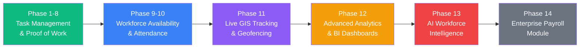
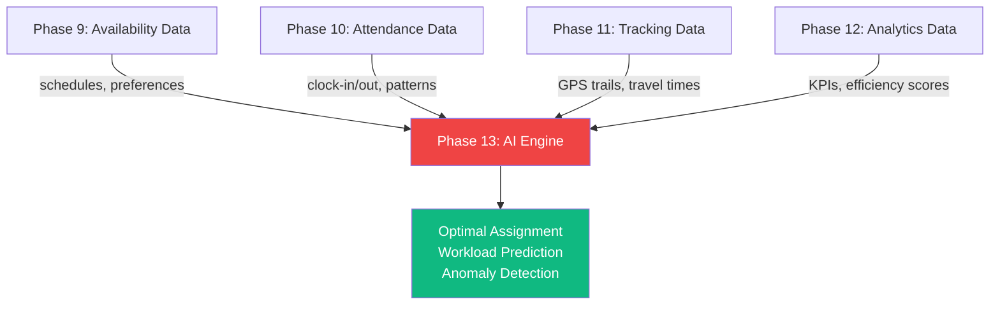
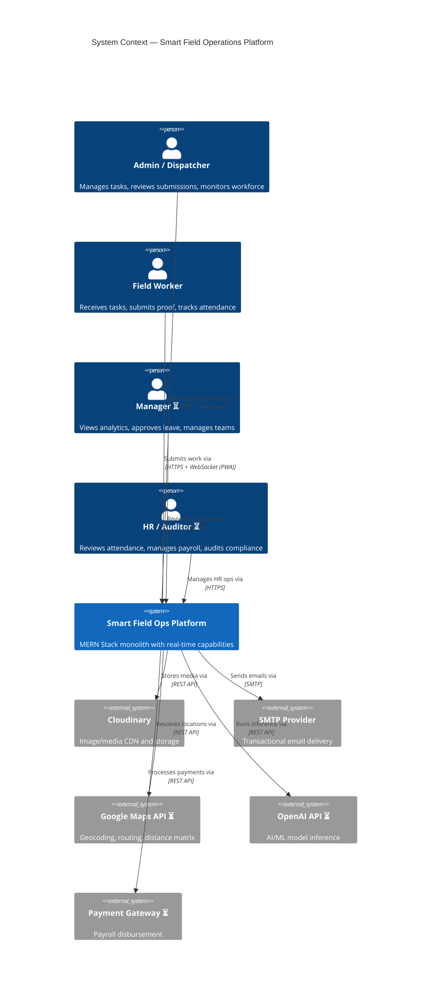
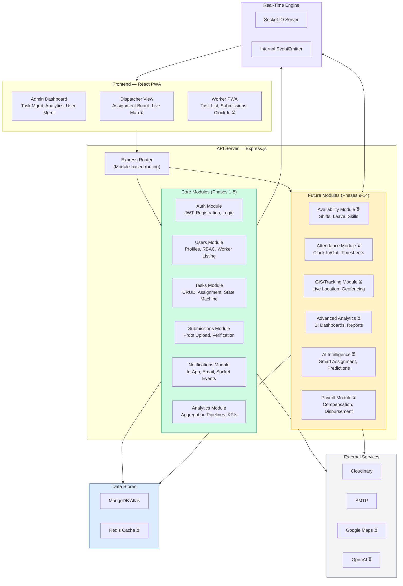
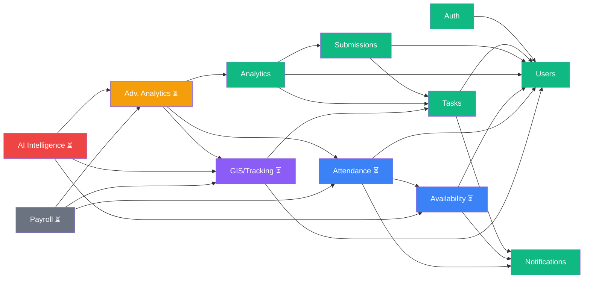
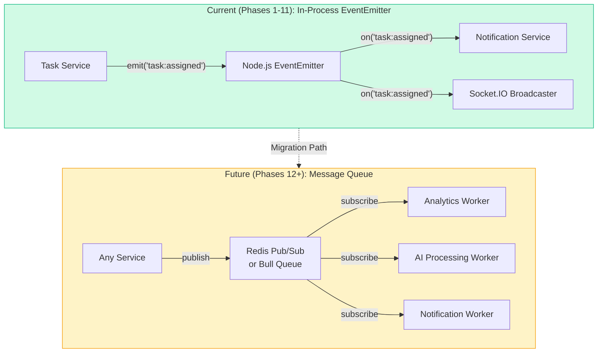
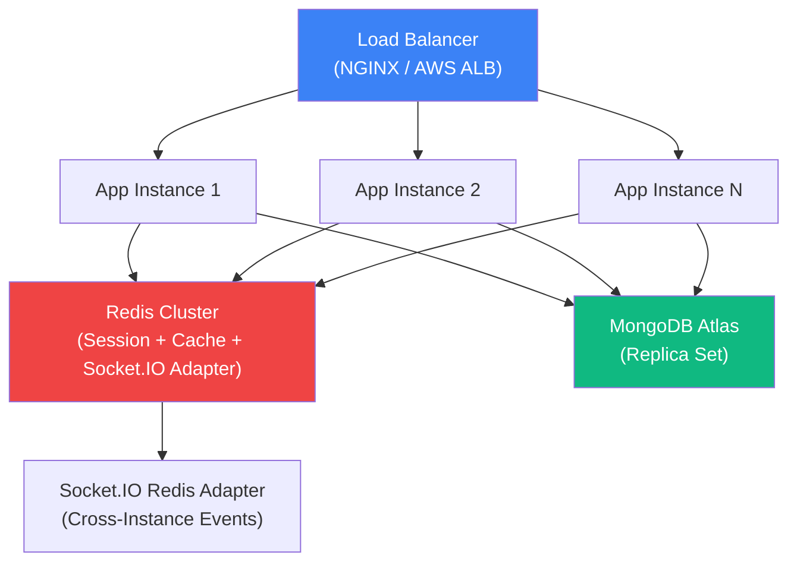
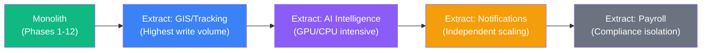

# Enterprise Architecture Blueprint

## Smart Field Operations & Workforce Management System

> **Document ID:** 09  
> **Version:** 1.0  
> **Status:** Living Document — Updated Each Phase  
> **Last Updated:** 2026-07-04  
> **Audience:** Engineering Leads, Solution Architects, Product Owners  
> **Prerequisite Reading:** [Architecture](./04-Architecture.md), [Database Design](./05-Database-Design.md), [API Specification](./06-API-Specification.md)

---

## Table of Contents

1. [Vision](#1-vision)
2. [Strategic Goals](#2-strategic-goals)
3. [Roadmap Rationale](#3-roadmap-rationale)
4. [Layered Architecture](#4-layered-architecture)
5. [High-Level Component Diagram](#5-high-level-component-diagram)
6. [System Modules](#6-system-modules)
7. [Integration Strategy](#7-integration-strategy)
8. [Future Scalability](#8-future-scalability)
9. [Technology Evolution](#9-technology-evolution)

---

## 1. Vision

### 1.1 Platform Evolution

The Smart Field Operations & Workforce Management System begins its life as a **task management and proof-of-work platform** — assigning work orders to field workers, tracking completion via photo/GPS evidence, and providing basic analytics dashboards. However, the platform's architecture has been deliberately designed from day one to evolve into a **full-spectrum Enterprise Smart Workforce Management System**.

This evolution is not a rewrite. It is a **controlled, incremental expansion** that adds capabilities phase by phase, with each phase producing a production-ready deliverable and feeding data into subsequent phases.



### 1.2 Core Differentiators

The platform distinguishes itself from commodity workforce management tools through three pillars:

| Differentiator | Description | Competitive Moat |
|---|---|---|
| **Real-Time GIS Tracking** | Sub-minute location updates with geofence validation, route optimization, and proximity-based task assignment | Requires deep Socket.IO + geospatial infrastructure that commodity tools lack |
| **AI Workforce Intelligence** | ML-driven optimal worker assignment, workload balancing, performance prediction, and anomaly detection | Requires 6+ months of operational data that competitors cannot bootstrap |
| **Predictive Analytics** | Forecasting task completion rates, workforce demand, seasonal patterns, and resource bottlenecks before they occur | Built on the data flywheel — each phase feeds richer data into the prediction engine |

### 1.3 Target Industries

| Industry | Primary Use Case | Key Features |
|---|---|---|
| **Delivery & Logistics** | Last-mile delivery tracking and proof of delivery | GPS tracking, photo verification, route optimization |
| **Field Maintenance** | Equipment repair scheduling and verification | Skill-based assignment, parts checklist, SLA tracking |
| **Utilities** | Meter reading, line inspection, emergency dispatch | Geofenced task zones, priority escalation, shift management |
| **Construction** | Site inspection, progress reporting, safety compliance | Multi-photo submissions, daily attendance, zone tracking |
| **General Field Services** | Sales visits, audits, installations | Flexible workflows, CRM integration, territory management |

### 1.4 Architectural Constraint

> **Critical Decision:** The platform MUST remain a **monolithic MERN application** during Phases 9–11. Module boundaries are enforced through code-level isolation (service-to-service contracts, no cross-module model access) rather than network boundaries. This preserves development velocity while establishing the seams required for future microservice extraction in Phases 12+.

---

## 2. Strategic Goals

The following goals drive all architectural and product decisions. Each goal is measurable, time-bound, and tied to a specific roadmap phase.

| # | Strategic Goal | Measurable Outcome | Target Phase | Priority |
|---|---|---|---|---|
| **SG-1** | **Operational Efficiency** | Reduce average task assignment-to-completion time by 40% through automated dispatch and real-time status visibility | Phase 9-11 | Critical |
| **SG-2** | **Workforce Utilization** | Achieve ≥85% utilization rate for field workers by eliminating scheduling gaps via availability management and intelligent assignment | Phase 9-10 | Critical |
| **SG-3** | **Real-Time Visibility** | Provide live location tracking for 100% of active field workers with ≤30-second position staleness | Phase 11 | Critical |
| **SG-4** | **Predictive Intelligence** | Forecast next-week workforce demand with ≥80% accuracy using historical patterns and ML models | Phase 12-13 | High |
| **SG-5** | **Compliance & Auditability** | Maintain immutable audit trails for all task state transitions, attendance records, and location history with full RBAC enforcement | Phase 9-10 | High |
| **SG-6** | **Data-Driven Decision Making** | Surface actionable KPIs (completion rates, SLA adherence, worker efficiency scores) within ≤5 seconds of dashboard load | Phase 12 | High |
| **SG-7** | **AI-Powered Assignment** | Reduce manual dispatcher intervention by 60% through AI-recommended task-worker matching based on skills, proximity, workload, and historical performance | Phase 13 | Medium |
| **SG-8** | **Platform Scalability** | Support 10,000+ concurrent field workers with ≤200ms p95 API latency without architectural changes | Phase 11-12 | High |
| **SG-9** | **Multi-Tenancy Readiness** | Enable isolated tenant data with shared infrastructure, supporting B2B SaaS deployment | Phase 14+ | Medium |
| **SG-10** | **Modular Extensibility** | Allow any single module (e.g., Payroll) to be extracted as an independent microservice within ≤2 sprint cycles | Ongoing | Medium |

---

## 3. Roadmap Rationale

### 3.1 The Revised Sequence

The roadmap follows a deliberate, dependency-aware sequence:

```
Availability → Attendance → Live Tracking → Advanced Analytics → AI Intelligence → Payroll
```

This differs significantly from a naive approach that would place Payroll immediately after Attendance. The rationale is rooted in **data dependency chains** and **business value delivery**.

### 3.2 Why NOT Availability → Attendance → Payroll?

The temptation to build Payroll immediately after Attendance is understandable — it creates a "complete HR workflow." However, this sequence is suboptimal for field operations companies for five critical reasons:

#### Reason 1: Field Operations Need Intelligence BEFORE Payroll

Field service companies do not hire a software platform to generate paychecks — existing payroll systems (ADP, Gusto, QuickBooks) handle that adequately. They invest in software to answer: *"Where are my workers? Are they productive? How do I deploy them better?"* Building tracking and analytics first delivers the value proposition that justifies the platform's existence.

#### Reason 2: Live Tracking & Analytics Are Core Differentiators

Payroll is a **commodity feature** — every HRMS has it, and integration with third-party payroll APIs is straightforward. Real-time GIS tracking with geofence validation and AI-driven workforce analytics are **differentiating capabilities** that establish competitive moat. Prioritizing differentiators over commodities is fundamental product strategy.

#### Reason 3: AI Requires Tracking & Analytics Data to Train

The AI Workforce Intelligence engine (Phase 13) requires rich, multi-dimensional training data:



Without 3–6 months of tracking and analytics data, the AI engine would have insufficient signal to produce meaningful recommendations. Placing Payroll before these phases would delay AI readiness by months.

#### Reason 4: The Data Flywheel Effect

Each phase generates data that amplifies the value of subsequent phases. This creates a **compounding data flywheel**:

| Phase | Data Generated | Consumed By |
|---|---|---|
| **9: Availability** | Shift schedules, time-off requests, skill inventories | Attendance, Tracking, Analytics, AI |
| **10: Attendance** | Clock-in/out timestamps, work hours, overtime | Tracking (validation), Analytics, AI, Payroll |
| **11: Tracking** | GPS trails, geofence events, route histories | Analytics (efficiency), AI (proximity), Payroll (mileage) |
| **12: Analytics** | KPIs, efficiency scores, trend data | AI (feature vectors), Payroll (performance bonuses) |
| **13: AI** | Recommendations, predictions, anomaly flags | Payroll (smart scheduling), all prior modules |
| **14: Payroll** | Compensation records | Analytics (cost analysis) |

Payroll at the end of this chain has access to the **richest possible data set** — not just hours worked, but GPS-verified hours, AI-validated productivity, and analytics-derived performance scores.

#### Reason 5: Payroll Is a Commodity; Intelligence Is the Value Proposition

```mermaid
quadrantChart
    title Feature Value vs. Market Differentiation
    x-axis Low Differentiation --> High Differentiation
    y-axis Low Business Value --> High Business Value
    quadrant-1 Build First (Differentiators)
    quadrant-2 Build Second (Table Stakes)
    quadrant-3 Deprioritize
    quadrant-4 Build Last (Commodity)
    Live Tracking: [0.85, 0.80]
    AI Intelligence: [0.90, 0.75]
    Advanced Analytics: [0.70, 0.85]
    Availability Mgmt: [0.40, 0.70]
    Attendance Mgmt: [0.35, 0.65]
    Payroll: [0.15, 0.55]
```

---

## 4. Layered Architecture

The system follows a strict layered architecture where each layer communicates only with its immediate neighbors. No layer may skip a level — the Presentation Layer never talks directly to the Data Access Layer.

### 4.1 Architecture Diagram

```mermaid
graph TB
    subgraph PL["🖥️ PRESENTATION LAYER"]
        direction LR
        PWA["React PWA<br/>(Vite + Tailwind)"]
        SW["Service Worker<br/>(Offline Cache)"]
        RT_CLIENT["Socket.IO Client<br/>(Real-Time Updates)"]
    end

    subgraph GW["🔒 API GATEWAY LAYER"]
        direction LR
        CORS["CORS Middleware"]
        RATE["Rate Limiter<br/>(express-rate-limit)"]
        AUTH_MW["JWT Auth<br/>Middleware"]
        RBAC["RBAC<br/>Middleware"]
        VALIDATE["Zod Validation<br/>Middleware"]
        HELMET["Helmet<br/>(Security Headers)"]
    end

    subgraph BL["⚙️ BUSINESS LOGIC LAYER"]
        direction LR
        AUTH_SVC["Auth<br/>Service"]
        USER_SVC["User<br/>Service"]
        TASK_SVC["Task<br/>Service"]
        SUB_SVC["Submission<br/>Service"]
        NOTIF_SVC["Notification<br/>Service"]
        ANALYTICS_SVC["Analytics<br/>Service"]
        AVAIL_SVC["Availability<br/>Service ⏳"]
        ATTEND_SVC["Attendance<br/>Service ⏳"]
        GIS_SVC["GIS/Tracking<br/>Service ⏳"]
        AI_SVC["AI Intelligence<br/>Service ⏳"]
        PAY_SVC["Payroll<br/>Service ⏳"]
    end

    subgraph DAL["💾 DATA ACCESS LAYER"]
        direction LR
        MODELS["Mongoose Models<br/>(Schema + Validation)"]
        REPOS["Query Builders<br/>(Aggregation Pipelines)"]
        IDX["Index Strategies<br/>(Compound, 2dsphere, TTL)"]
    end

    subgraph REAL["📡 REAL-TIME LAYER"]
        direction LR
        SOCKET["Socket.IO Server"]
        EVENTS["EventEmitter Bus"]
        ROOMS["Room Management<br/>(User/Admin Rooms)"]
    end

    subgraph INFRA["🏗️ INFRASTRUCTURE LAYER"]
        direction LR
        MONGO["MongoDB Atlas<br/>(Primary Store)"]
        REDIS["Redis ⏳<br/>(Cache + Sessions)"]
        CLOUD["Cloudinary<br/>(Media Storage)"]
        SMTP["SMTP/Nodemailer<br/>(Email Delivery)"]
        MAPS["Google Maps API ⏳<br/>(Geocoding)"]
        OPENAI["OpenAI API ⏳<br/>(AI/ML)"]
    end

    PL --> GW
    GW --> BL
    BL --> DAL
    BL --> REAL
    DAL --> INFRA
    REAL --> PL

    style PL fill:#DBEAFE,stroke:#3B82F6,color:#1E3A5F
    style GW fill:#FEE2E2,stroke:#EF4444,color:#7F1D1D
    style BL fill:#D1FAE5,stroke:#10B981,color:#064E3B
    style DAL fill:#FEF3C7,stroke:#F59E0B,color:#78350F
    style REAL fill:#EDE9FE,stroke:#8B5CF6,color:#4C1D95
    style INFRA fill:#F3F4F6,stroke:#6B7280,color:#1F2937
```



*Items marked with ⏳ are planned for future phases.*

### 4.2 Layer Responsibilities

| Layer | Responsibility | Technologies | Rules |
|---|---|---|---|
| **Presentation** | UI rendering, state management, offline caching, real-time event consumption | React 18, Tailwind CSS, Zustand/Redux, Socket.IO Client, Workbox | No business logic. All data flows through API calls. |
| **API Gateway** | Request authentication, authorization, validation, rate limiting, security headers | Express.js, JWT, Zod, Helmet, CORS, express-rate-limit | Stateless. Every request must pass all middleware before reaching controllers. |
| **Business Logic** | Domain rules, workflow orchestration, cross-module coordination, event emission | Node.js service classes, EventEmitter | Controllers are thin wrappers. Services contain ALL business rules. |
| **Data Access** | Schema definition, query construction, index management, aggregation pipelines | Mongoose 7+, MongoDB aggregation framework | No business logic in models. Models define shape; services define behavior. |
| **Real-Time** | Bidirectional event streaming, room-based broadcasting, connection lifecycle | Socket.IO 4+, Node.js EventEmitter | Events are fire-and-forget. The real-time layer never blocks the request pipeline. |
| **Infrastructure** | Persistent storage, caching, media hosting, email delivery, external APIs | MongoDB Atlas, Redis, Cloudinary, Nodemailer, Google Maps, OpenAI | Accessed only through the Data Access Layer or dedicated service adapters. |

---

## 5. High-Level Component Diagram

### 5.1 C4-Style System Context



### 5.2 Internal Component Architecture



---

## 6. System Modules

### 6.1 Module Registry

Every module in the system — current and planned — is cataloged below with its domain responsibility, lifecycle phase, dependencies, and key APIs.

#### Current Modules (Phases 1–8)

| Module | Domain Responsibility | Phase | Dependencies | Key APIs |
|---|---|---|---|---|
| **Auth** | User registration, login, JWT token management (access + refresh), session validation | Phase 1 | Users (for profile creation) | `POST /api/auth/register`, `POST /api/auth/login`, `GET /api/auth/me`, `POST /api/auth/refresh` |
| **Users** | User profile management, role-based access control, worker listing, status management | Phase 1 | Auth (for identity context) | `GET /api/users/workers`, `GET /api/users/:id`, `PATCH /api/users/:id`, `DELETE /api/users/:id` |
| **Tasks** | Task lifecycle management (create → assign → in-progress → completed → verified), priority and deadline tracking, assignment engine | Phase 2 | Users (assignee lookup), Notifications (event broadcast) | `POST /api/tasks`, `GET /api/tasks`, `GET /api/tasks/my-tasks`, `PATCH /api/tasks/:id/status`, `PATCH /api/tasks/:id/verify` |
| **Submissions** | Proof-of-work capture (photos, GPS, notes), Cloudinary upload orchestration, admin verification workflow | Phase 3 | Tasks (state transition), Users (worker identity), Cloudinary (media storage) | `POST /api/submissions`, `GET /api/upload/signature`, `GET /api/submissions/:taskId` |
| **Notifications** | In-app notification storage, Socket.IO real-time broadcasting, email delivery via Nodemailer, notification read-state management | Phase 4 | Users (recipient resolution), Socket.IO (delivery channel) | `GET /api/notifications`, `PATCH /api/notifications/:id/read`, `DELETE /api/notifications/:id` |
| **Analytics** | MongoDB aggregation pipeline execution, KPI computation (completion rates, worker rankings, overdue counts), date-range filtering | Phase 5 | Tasks, Submissions, Users (data sources) | `GET /api/analytics/summary`, `GET /api/analytics/workers`, `GET /api/analytics/trends` |

#### Future Modules (Phases 9–14)

| Module | Domain Responsibility | Phase | Dependencies | Key APIs (Planned) |
|---|---|---|---|---|
| **Availability** | Worker shift scheduling, time-off/leave requests, skill/certification inventory, capacity planning | Phase 9 | Users, Notifications | `POST /api/availability/shifts`, `GET /api/availability/schedule`, `POST /api/availability/leave-requests`, `GET /api/availability/capacity` |
| **Attendance** | GPS-verified clock-in/out, timesheet generation, overtime calculation, break tracking, attendance policy enforcement | Phase 10 | Users, Availability (shift context), GIS (location verification), Notifications | `POST /api/attendance/clock-in`, `POST /api/attendance/clock-out`, `GET /api/attendance/timesheets`, `GET /api/attendance/reports` |
| **GIS / Tracking** | Real-time worker location streaming, geofence zone management, route history storage, proximity-based queries, travel distance calculation | Phase 11 | Users, Tasks (location context), Socket.IO (live streaming), Google Maps API | `GET /api/tracking/live`, `POST /api/tracking/geofences`, `GET /api/tracking/history/:workerId`, `GET /api/tracking/nearby` |
| **Advanced Analytics** | Multi-dimensional BI dashboards, custom report builder, trend analysis, SLA monitoring, exportable reports (PDF/CSV), scheduled report delivery | Phase 12 | All prior modules (data sources), Redis (caching) | `GET /api/analytics/v2/dashboard`, `POST /api/analytics/v2/reports`, `GET /api/analytics/v2/export`, `GET /api/analytics/v2/sla` |
| **AI Intelligence** | ML-driven worker-task matching, workload prediction, anomaly detection (e.g., unusual clock-in patterns), natural language task creation, performance forecasting | Phase 13 | Availability, Attendance, Tracking, Analytics (training data), OpenAI API | `POST /api/ai/recommend-assignment`, `GET /api/ai/workload-forecast`, `GET /api/ai/anomalies`, `POST /api/ai/natural-language-task` |
| **Payroll** | Compensation calculation (hourly/salaried), overtime pay rules, mileage reimbursement, tax deduction scaffolding, payment gateway integration, payslip generation | Phase 14 | Attendance (hours), Tracking (mileage), Analytics (performance bonuses), AI (schedule optimization) | `POST /api/payroll/calculate`, `GET /api/payroll/payslips`, `POST /api/payroll/disburse`, `GET /api/payroll/reports` |

### 6.2 Module Dependency Matrix



### 6.3 New Roles Introduced

| Role | Phase Introduced | Permissions Scope | Description |
|---|---|---|---|
| **Admin** | Phase 1 (existing) | Full system access | Creates tasks, manages users, verifies submissions, configures system |
| **Dispatcher** | Phase 1 (existing) | Task assignment + worker visibility | Assigns tasks to workers, views schedules, monitors field status |
| **Worker** | Phase 1 (existing) | Own tasks + submissions | Receives assignments, submits proof, manages own attendance |
| **Manager** | Phase 12 | Team analytics + approval workflows | Views team performance dashboards, approves leave, manages escalations |
| **HR** | Phase 14 | Attendance + payroll + compliance | Reviews timesheets, processes payroll, generates compliance reports |
| **Auditor** | Phase 14 | Read-only across all modules | Full read access for compliance auditing; cannot modify any data |

---

## 7. Integration Strategy

### 7.1 Internal Module Communication

All inter-module communication within the monolith follows the **Service Import Pattern** established in [Architecture](./04-Architecture.md):

```
✅ CORRECT:  taskService.js → import userService → userService.findWorkerById()
❌ VIOLATION: taskService.js → import UserModel → UserModel.findById()
```

**Rules:**
1. **No cross-module model imports.** A module's Mongoose model is private to that module.
2. **Service-to-service calls only.** Modules expose public service functions that other modules consume.
3. **Circular dependency prevention.** If Module A depends on Module B, then Module B MUST NOT depend on Module A. Use the EventEmitter for reverse notifications.

### 7.2 Event Bus Architecture

The system uses a progressive event architecture that scales from simple in-process events to distributed message queues:



**Event Catalog (Current):**

| Event Name | Emitted By | Consumed By | Payload |
|---|---|---|---|
| `task:created` | Task Service | Notification Service, Socket.IO | `{ task, assignedTo }` |
| `task:assigned` | Task Service | Notification Service, Socket.IO | `{ taskId, workerId, assignedBy }` |
| `task:statusChanged` | Task Service | Notification Service, Analytics Service | `{ taskId, oldStatus, newStatus, changedBy }` |
| `submission:created` | Submission Service | Notification Service, Socket.IO | `{ submission, taskId }` |
| `task:verified` | Task Service | Notification Service, Analytics Service | `{ taskId, verifiedBy, feedback }` |
| `user:registered` | Auth Service | Notification Service (welcome email) | `{ userId, email, role }` |

**Future Events (Phases 9+):**

| Event Name | Phase | Emitted By | Consumed By |
|---|---|---|---|
| `availability:shiftCreated` | 9 | Availability Service | Notification Service |
| `availability:leaveRequested` | 9 | Availability Service | Notification Service, Manager Dashboard |
| `attendance:clockIn` | 10 | Attendance Service | Tracking Service, Analytics Service |
| `attendance:clockOut` | 10 | Attendance Service | Tracking Service, Analytics Service, Payroll |
| `tracking:locationUpdate` | 11 | GIS Service | Socket.IO, Analytics Service |
| `tracking:geofenceViolation` | 11 | GIS Service | Notification Service, Attendance Service |
| `ai:recommendationReady` | 13 | AI Service | Notification Service, Dispatcher UI |

### 7.3 External Integrations

| Integration | Protocol | Phase | Purpose | Adapter Pattern |
|---|---|---|---|---|
| **Cloudinary** | REST API (signed uploads) | Current | Image/media storage for submissions | `cloudinaryAdapter.js` in `/config` |
| **Nodemailer/SMTP** | SMTP | Current | Transactional email delivery | `emailService.js` in Notification module |
| **Google Maps Platform** | REST API | Phase 11 | Geocoding, reverse geocoding, distance matrix, directions | `mapsAdapter.js` in GIS module |
| **OpenAI API** | REST API | Phase 13 | GPT-4 for NL task creation; embeddings for skill matching | `aiAdapter.js` in AI module |
| **Payment Gateway** | REST API (Razorpay/Stripe) | Phase 14 | Payroll disbursement processing | `paymentAdapter.js` in Payroll module |

All external integrations follow the **Adapter Pattern**: a thin wrapper module that isolates the external API's interface, making it swappable without affecting business logic.

### 7.4 API Versioning Strategy

| Phase | Version | Strategy | Details |
|---|---|---|---|
| Phases 1–11 | `v1` (implicit) | No explicit versioning | All APIs live under `/api/*`. The system is pre-production or early production with a controlled user base. |
| Phase 12+ | `v2` (explicit) | URL prefix versioning | New analytics APIs introduced under `/api/v2/analytics/*`. Legacy `/api/analytics/*` routes remain active with deprecation headers. |
| Phase 14+ | `v2` | Header-based negotiation | `Accept-Version: v2` header supported as an alternative. URL prefix remains the primary mechanism. |

**Deprecation Policy:** Deprecated API versions will return a `Sunset` header and remain functional for 6 months after the successor version reaches GA.

---

## 8. Future Scalability

### 8.1 Horizontal Scaling Strategy



**Scaling Triggers:**

| Metric | Threshold | Action |
|---|---|---|
| API p95 latency | > 200ms | Add app instance behind load balancer |
| WebSocket connections per instance | > 5,000 | Add instance + enable Socket.IO Redis adapter |
| MongoDB query time | > 100ms average | Review indexes, consider read replicas |
| Memory usage per instance | > 80% | Vertical scale instance, profile for memory leaks |

### 8.2 Database Sharding Plan

**Phase 1 (Current — Phases 1-11): Vertical Scaling + Indexing**
- MongoDB Atlas M10+ tier with automated backups
- Compound indexes on all high-traffic query patterns (defined in [Database Design](./05-Database-Design.md))
- Read replicas for analytics queries to avoid impacting transactional workloads

**Phase 2 (Phases 12-13): Collection-Level Partitioning**
- Separate the `LocationHistory` collection (high-write, append-only) onto a dedicated MongoDB cluster
- Time-series collections for GPS tracking data with automatic expiration
- Analytics aggregation results cached in Redis with configurable TTL

**Phase 3 (Phase 14+): Shard Key Strategy**
- Shard `LocationHistory` by `{ workerId: 1, timestamp: 1 }` (range-based)
- Shard `Attendance` by `{ tenantId: 1, workerId: 1 }` (hash + range for multi-tenancy)
- Core collections (`Tasks`, `Users`) remain unsharded — they are low-volume relative to tracking data

### 8.3 Redis Caching Layer

| Cache Type | Key Pattern | TTL | Use Case |
|---|---|---|---|
| **Session Store** | `session:{userId}` | 24h | JWT refresh token validation, user session metadata |
| **Dashboard Cache** | `analytics:summary:{dateRange}` | 5 min | Prevent redundant aggregation pipeline execution |
| **Worker List** | `workers:active` | 2 min | Frequently queried for task assignment dropdowns |
| **Geofence Zones** | `geofences:{zoneId}` | 1h | Pre-loaded geofence polygons for server-side validation |
| **Rate Limit Counters** | `ratelimit:{ip}:{endpoint}` | 15 min | API rate limiting state |
| **Socket.IO Adapter** | Managed by `@socket.io/redis-adapter` | N/A | Cross-instance Socket.IO event broadcasting |

### 8.4 CDN Strategy

| Asset Type | CDN Provider | Cache Policy | Origin |
|---|---|---|---|
| React static assets (JS, CSS) | Cloudflare / AWS CloudFront | Immutable, 1-year cache with content-hash filenames | Vite build output |
| Submission images | Cloudinary (built-in CDN) | Aggressive caching with on-the-fly transformations | Direct upload from frontend |
| Map tiles | Mapbox / Google Maps | Provider-managed CDN | Provider infrastructure |
| PWA service worker | Application server | `no-cache` (must always be fresh) | Express static middleware |

### 8.5 Microservice Extraction Path

The modular architecture enables surgical extraction of modules into independent services when scaling demands require it. The extraction sequence is prioritized by I/O intensity and scaling independence:



**Extraction Checklist (per module):**
1. ✅ Module already uses service-to-service contracts (no cross-model imports)
2. ✅ Module communicates via EventEmitter (swap to Redis Pub/Sub or RabbitMQ)
3. ⬜ Create dedicated database/collection namespace
4. ⬜ Expose module APIs via dedicated Express server
5. ⬜ Replace in-process service imports with HTTP/gRPC client calls
6. ⬜ Deploy as independent container (Docker + Kubernetes)
7. ⬜ Update API gateway routing rules

### 8.6 Multi-Tenancy Considerations

Multi-tenancy support (Phase 14+) will use the **Database-per-Tenant** strategy for large enterprise clients and **Shared Database, Separate Collections** for smaller clients:

| Tenant Tier | Isolation Strategy | Data Isolation | Performance Isolation |
|---|---|---|---|
| **Enterprise** | Dedicated MongoDB cluster | Full physical isolation | Dedicated compute resources |
| **Business** | Shared cluster, separate database | Logical database isolation | Shared compute, tenant-aware rate limits |
| **Starter** | Shared database, `tenantId` field | Row-level filtering via middleware | Shared everything, strict rate limits |

**Tenant Context Middleware:**
```
Every request → Extract tenantId from JWT → Inject into request context →
All Mongoose queries automatically scoped by tenantId via query middleware
```

---

## 9. Technology Evolution

### 9.1 Phase-by-Phase Stack Growth

```mermaid
timeline
    title Technology Stack Evolution
    section Phase 9-10 : Availability & Attendance
        Core MERN Stack : MongoDB, Express, React 18, Node.js 20
        Validation : Zod schemas for complex shift/attendance rules
        Caching : Redis introduction for session store and dashboard cache
        Real-Time : Socket.IO for live attendance status updates
    section Phase 11 : Live GIS Tracking
        Mapping : Leaflet.js or Mapbox GL JS for interactive maps
        Geospatial : turf.js for client-side geometry calculations
        Database : MongoDB 2dsphere indexes and geospatial queries
        Streaming : Socket.IO high-frequency location streams
    section Phase 12 : Advanced Analytics
        Visualization : Chart.js or D3.js for interactive dashboards
        Pipelines : MongoDB Aggregation Framework (advanced stages)
        Export : PDFKit and csv-writer for report generation
        Caching : Redis with computed analytics result caching
    section Phase 13 : AI Workforce Intelligence
        AI/ML : OpenAI API (GPT-4, embeddings) for NL and matching
        ML Runtime : TensorFlow.js for client-side inference (optional)
        Vectors : MongoDB Atlas Vector Search for skill matching
        Scheduling : Bull queue for async AI job processing
    section Phase 14 : Enterprise Payroll
        Payments : Razorpay or Stripe API for disbursement
        Documents : PDFKit for payslip generation
        Compliance : Tax rule engine (region-specific configuration)
        Security : Enhanced encryption for financial data at rest
```

### 9.2 Detailed Technology Matrix

| Technology | Category | Introduced | Purpose | Alternatives Considered |
|---|---|---|---|---|
| **MongoDB 7+** | Database | Phase 1 | Primary data store, geospatial queries, aggregation | PostgreSQL (rejected: schema rigidity) |
| **Express 4.x** | API Framework | Phase 1 | HTTP routing, middleware pipeline | Fastify (considered for Phase 12+ migration) |
| **React 18** | Frontend Framework | Phase 1 | Component UI, PWA shell | Next.js (rejected: SSR unnecessary for this app) |
| **Node.js 20 LTS** | Runtime | Phase 1 | Server runtime, async I/O | Deno (rejected: ecosystem maturity) |
| **Socket.IO 4+** | Real-Time | Phase 1 | Bidirectional events, room-based broadcasting | WebSocket API (rejected: need fallback + rooms) |
| **Tailwind CSS 3** | Styling | Phase 1 | Utility-first responsive UI | Material UI (rejected: heavier bundle) |
| **Zod** | Validation | Phase 1 | Runtime type validation (frontend + backend) | Joi (rejected: no TypeScript inference) |
| **JWT (jsonwebtoken)** | Auth | Phase 1 | Stateless authentication tokens | Session-based auth (rejected: scaling complexity) |
| **Cloudinary** | Media Storage | Phase 3 | Image CDN with transformations | AWS S3 (considered for Phase 14+ for cost) |
| **Nodemailer** | Email | Phase 4 | Transactional email delivery | SendGrid (considered for Phase 12+ for analytics) |
| **Redis** | Cache/Pub-Sub | Phase 9 | Session store, cache, Socket.IO adapter, job queues | Memcached (rejected: no pub/sub support) |
| **Leaflet.js** | Mapping | Phase 11 | Open-source interactive maps | Mapbox GL JS (alternative for 3D terrain) |
| **turf.js** | Geospatial | Phase 11 | Client-side geometry (point-in-polygon, distance) | PostGIS (rejected: staying with MongoDB) |
| **Chart.js** | Visualization | Phase 12 | Interactive charts and graphs | D3.js (alternative for complex custom viz) |
| **PDFKit** | Documents | Phase 12 | Report and payslip PDF generation | Puppeteer (heavier, considered for complex layouts) |
| **Bull** | Job Queue | Phase 13 | Async job processing for AI inference | Agenda (rejected: less Redis-native) |
| **OpenAI API** | AI/ML | Phase 13 | NL processing, embeddings, recommendations | Hugging Face (considered for self-hosted models) |
| **TensorFlow.js** | ML Runtime | Phase 13 | Optional client-side inference for offline predictions | ONNX Runtime (alternative) |
| **Razorpay/Stripe** | Payments | Phase 14 | Payroll disbursement and payment processing | Direct bank API integration (complex, deferred) |

### 9.3 Development Tooling Evolution

| Tool | Current | Phase 12+ | Purpose |
|---|---|---|---|
| **Build** | Vite | Vite (unchanged) | Frontend bundling |
| **Testing** | Jest + Supertest | + Playwright (E2E) | Backend unit/integration + frontend E2E |
| **CI/CD** | GitHub Actions | + Docker + K8s manifests | Automated build, test, deploy pipeline |
| **Monitoring** | Console logging | + Winston + Prometheus + Grafana | Structured logging, metrics, alerting |
| **Error Tracking** | Manual | + Sentry | Automated error capture and alerting |
| **API Docs** | Markdown | + Swagger/OpenAPI 3.0 | Auto-generated interactive API documentation |

---

## Cross-References

| Document | Relevance |
|---|---|
| [Domain-Driven Design](./10-Domain-Driven-Design.md) | Bounded contexts, aggregates, and ubiquitous language for each module |
| [Module Dependencies](./11-Module-Dependency-Graph.md) | Detailed inter-module dependency analysis and circular dependency prevention |
| [Implementation Phases v2](./18-Implementation-Phases-v2.md) | Sprint-level breakdown of the revised roadmap with acceptance criteria |
| [Architecture](./04-Architecture.md) | Original architecture decisions and folder structure |
| [Database Design](./05-Database-Design.md) | Collection schemas, indexes, and normalization decisions |
| [API Specification](./06-API-Specification.md) | Current REST API endpoint specifications |

---

> **Document Governance:** This blueprint is a living document. It MUST be reviewed and updated at the start of each new phase. All architectural decisions that deviate from this blueprint require a written Architecture Decision Record (ADR) reviewed by the engineering lead.
