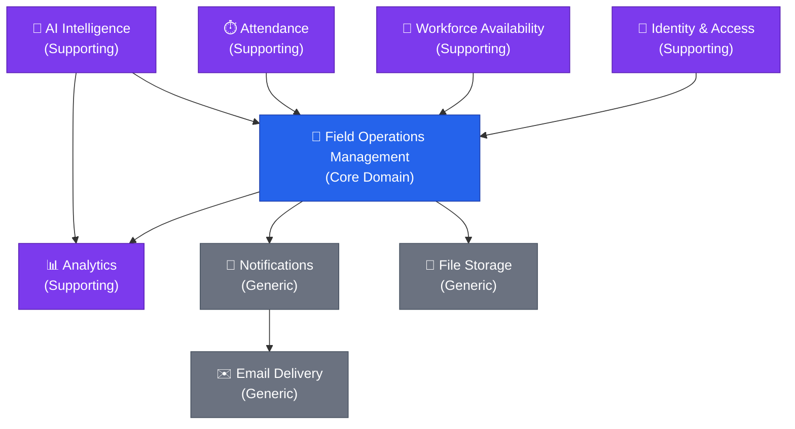
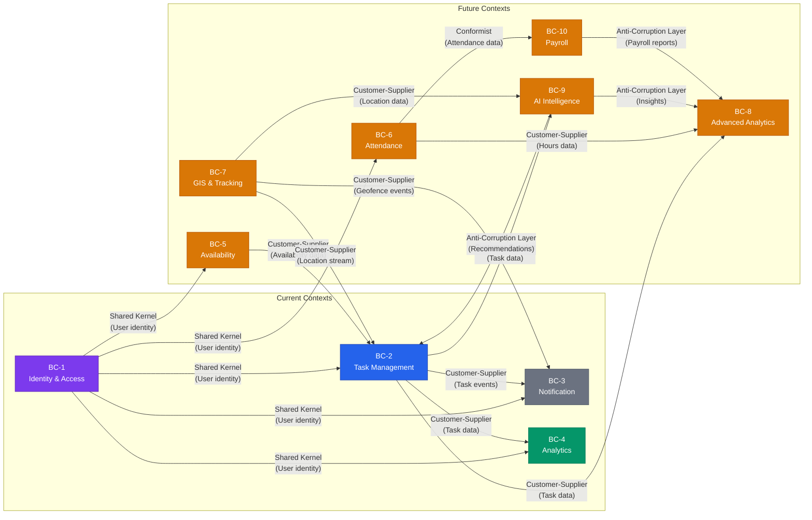
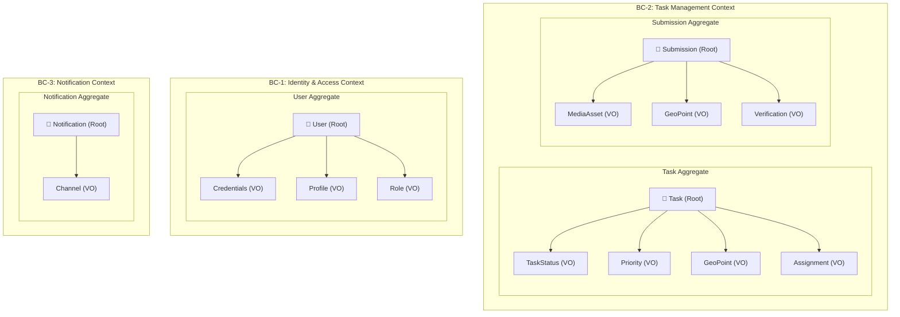
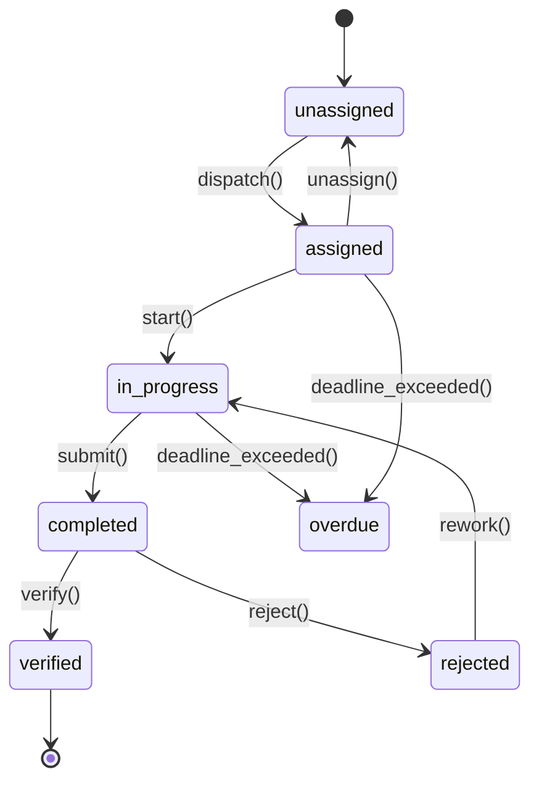
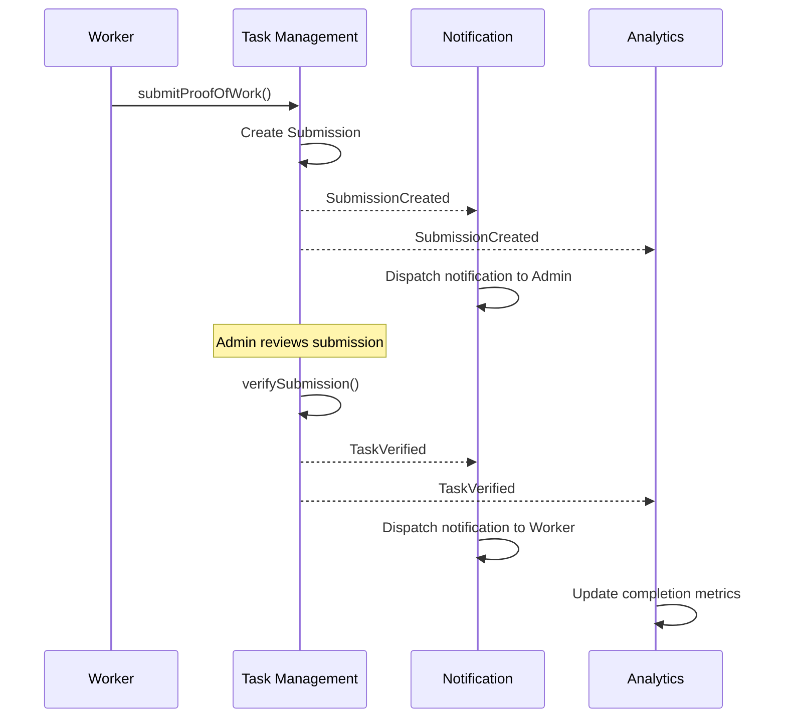
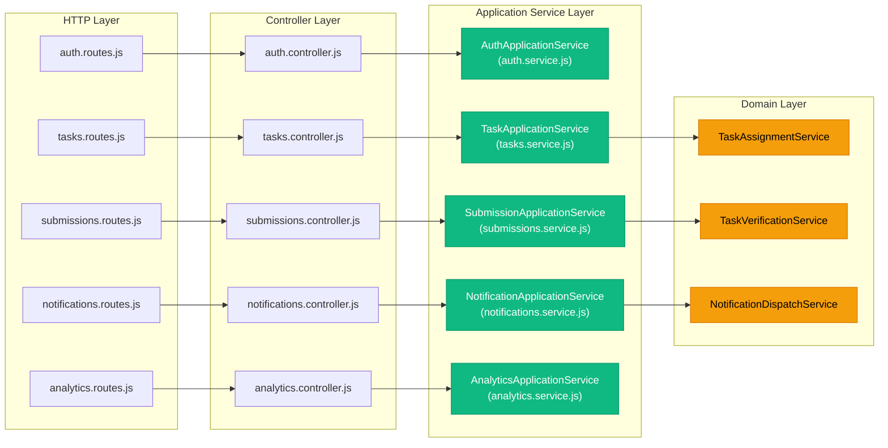

# Domain-Driven Design (DDD) Model

## Smart Field Operations & Workforce Management System

> **Document 10** of the Smart Field Operations documentation suite.
> This document establishes the Domain-Driven Design foundation that governs how business
> concepts are modelled, how bounded contexts communicate, and how the codebase maps to
> the problem domain. Every future module (Phases 9–14) MUST conform to the patterns
> defined here.

---

## Table of Contents

1. [Strategic Domain Analysis](#1-strategic-domain-analysis)
2. [Ubiquitous Language](#2-ubiquitous-language)
3. [Bounded Contexts & Context Map](#3-bounded-contexts--context-map)
4. [Aggregates](#4-aggregates)
5. [Entities](#5-entities)
6. [Value Objects](#6-value-objects)
7. [Domain Events](#7-domain-events)
8. [Repositories](#8-repositories)
9. [Domain Services](#9-domain-services)
10. [Application Services](#10-application-services)

---

## 1. Strategic Domain Analysis

Domain-Driven Design begins with identifying what the business *truly* cares about (the Core Domain), what supports that core (Supporting Domains), and what can be treated as commodity infrastructure (Generic Domains). This classification guides investment decisions — the Core Domain receives the richest modelling, the most skilled developers, and the most rigorous testing.

### 1.1 Domain Classification

| Classification | Domain | Rationale |
|---|---|---|
| **Core** | **Field Operations Management** | The primary value proposition — task lifecycle, dispatch, real-time tracking, proof-of-work verification. This is the irreplaceable competitive differentiator. |
| Supporting | Identity & Access Management | Essential for security and RBAC but not a business differentiator. Standard JWT/session patterns apply. |
| Supporting | Workforce Availability | Directly impacts dispatch quality. Must integrate tightly with the Core domain. |
| Supporting | Attendance Management | Enables compliance and payroll downstream. Shares geolocation concerns with the Core domain. |
| Supporting | Analytics & Reporting | Transforms operational data into business insight. Consumes events from the Core domain. |
| Supporting | AI Workforce Intelligence | Enhances dispatch decisions with ML-driven recommendations. Depends heavily on Core domain data. |
| Generic | Notifications | Email, push, and in-app messaging. Off-the-shelf or SaaS-replaceable. |
| Generic | File Storage | Cloudinary-backed media uploads. Pure infrastructure concern. |
| Generic | Email Delivery | Transactional emails. Delegated to third-party providers (SendGrid, SES). |

### 1.2 Sub-Domain Dependency Graph



---

## 2. Ubiquitous Language

The Ubiquitous Language is the shared vocabulary used by **all** team members — developers, product owners, dispatchers, and domain experts. Every term below MUST be used consistently in code (variable names, class names, API fields), documentation, and conversation. Ambiguity is a bug.

| Term | Definition |
|---|---|
| **Task** | A discrete unit of field work with a defined location, deadline, priority, and lifecycle status. The fundamental entity of the Core domain. |
| **Work Order** | A business-facing synonym for Task, used in reports and customer-facing documents. Maps 1:1 to a Task entity. |
| **Dispatch** | The act of assigning a Task to a Worker, performed by a Dispatcher or auto-assignment algorithm. |
| **Assignment** | The binding relationship between a Task and a Worker. A Task may be re-assigned, creating a new Assignment. |
| **Proof of Work** | A Submission containing media (photos/videos), notes, and geolocation that proves a Task was physically completed. |
| **Verification** | The review process where an Admin or Dispatcher examines a Submission and marks the Task as `verified` or `rejected`. |
| **Submission** | The digital artefact a Worker uploads upon completing a Task. Contains images, notes, and submitted location. |
| **Geofence** | A virtual geographic boundary (polygon or circle) that triggers events when a Worker enters or exits. |
| **Availability Window** | A recurring or one-off time range during which a Worker is available for dispatch. |
| **Attendance Record** | A timestamped check-in / check-out pair that records a Worker's on-duty hours at a specific location. |
| **Check-in** | The act of a Worker recording their arrival at a work location, capturing timestamp and GPS coordinates. |
| **Check-out** | The act of a Worker recording their departure, completing an Attendance Record. |
| **Shift** | A named time period (e.g., "Morning 06:00–14:00") used to group Availability Windows and Attendance Records. |
| **Route** | An ordered sequence of Waypoints representing the path a Worker should follow to complete multiple Tasks. |
| **Waypoint** | A single stop within a Route, associated with a Task location. |
| **Worker Pool** | A logical grouping of Workers sharing common attributes (region, skills, shift) used for dispatch targeting. |
| **Skill Matrix** | The set of skills, certifications, and qualifications associated with a Worker, used to match Workers to Tasks. |
| **SLA** | Service Level Agreement — the contractual time constraints governing Task completion (e.g., "resolve within 4 hours of assignment"). |
| **Priority** | The urgency classification of a Task: `low`, `medium`, `high`, or `urgent`. Determines SLA and dispatch ordering. |
| **Live Location** | A Worker's real-time GPS position, updated at configurable intervals while on duty. |
| **Notification** | A system-generated message delivered via in-app (Socket.IO), push, or email to inform a user of an event. |
| **Media Asset** | An image or video uploaded to Cloudinary as part of a Submission or user profile. |

---

## 3. Bounded Contexts & Context Map

A Bounded Context is a semantic boundary within which a particular model is defined and applicable. Each context owns its data, its language nuances, and its consistency rules. Communication between contexts is explicit and governed by well-defined integration patterns.

### 3.1 Bounded Context Inventory

| # | Bounded Context | Status | Owner Module(s) | Primary Aggregate(s) |
|---|---|---|---|---|
| BC-1 | Identity & Access Context | ✅ Current | `auth`, `users` | User |
| BC-2 | Task Management Context | ✅ Current | `tasks`, `submissions` | Task, Submission |
| BC-3 | Notification Context | ✅ Current | `notifications` | Notification |
| BC-4 | Analytics Context | ✅ Current | `analytics` | AnalyticsSnapshot (read-model) |
| BC-5 | Availability Context | 🔮 Phase 9 | `availability` | AvailabilitySchedule |
| BC-6 | Attendance Context | 🔮 Phase 10 | `attendance` | AttendanceRecord |
| BC-7 | GIS & Tracking Context | 🔮 Phase 11 | `tracking`, `geofences` | LiveLocation, Geofence |
| BC-8 | Advanced Analytics Context | 🔮 Phase 12 | `advanced-analytics` | AnalyticsPipeline (read-model) |
| BC-9 | AI Intelligence Context | 🔮 Phase 13 | `ai-intelligence` | AIRecommendation |
| BC-10 | Payroll Context | 🔮 Phase 14 | `payroll` | PayrollEntry |

### 3.2 Context Map

The context map below shows every bounded context and the integration pattern governing each relationship. Arrows point from **upstream** (supplier) to **downstream** (consumer).



### 3.3 Integration Pattern Definitions

| Pattern | Description | Used Between |
|---|---|---|
| **Shared Kernel** | Both contexts share a small, explicitly defined subset of the domain model (e.g., `userId`, `role`). Changes require agreement from both teams. | Identity & Access ↔ All other contexts |
| **Customer-Supplier** | The upstream context (Supplier) publishes data/events that the downstream context (Customer) consumes. The Supplier commits to a stable contract. | Task Mgmt → Notification, Task Mgmt → Analytics, GIS → Task Mgmt, Availability → Task Mgmt |
| **Conformist** | The downstream context accepts the upstream model as-is without translation. Suitable when the upstream model is simple and stable. | Attendance → Payroll |
| **Anti-Corruption Layer (ACL)** | The downstream context builds a translation layer to protect its model from upstream changes. Used when the upstream model is volatile or conceptually different. | AI Intelligence → Task Mgmt, AI Intelligence → Analytics, Payroll → Analytics |

---

## 4. Aggregates

An Aggregate is a cluster of domain objects treated as a single unit for data changes. Every Aggregate has a **Root Entity** that serves as the sole entry point. External objects may only reference the Aggregate by the Root's identity.

### 4.1 Aggregate Overview Diagram



### 4.2 Current Aggregates — Detailed Specifications

#### 4.2.1 Task Aggregate (BC-2: Task Management)

| Property | Details |
|---|---|
| **Root Entity** | `Task` |
| **Identity** | `_id: ObjectId` (MongoDB-generated) |
| **Contained Value Objects** | `TaskStatus`, `Priority`, `GeoPoint`, `Assignment`, `DateRange` |
| **Invariants** | A Task MUST have a `createdBy` reference. Status transitions MUST follow the defined state machine (see §6). A Task cannot be assigned to an inactive Worker. Deadline MUST be in the future at creation time. |
| **Consistency Boundary** | All status changes, re-assignments, and deadline modifications are atomic within this aggregate. |
| **Domain Events Emitted** | `TaskCreated`, `TaskAssigned`, `TaskStarted`, `TaskCompleted`, `TaskVerified`, `TaskRejected` |

#### 4.2.2 Submission Aggregate (BC-2: Task Management)

| Property | Details |
|---|---|
| **Root Entity** | `Submission` |
| **Identity** | `_id: ObjectId` |
| **Contained Value Objects** | `MediaAsset[]`, `GeoPoint`, `Verification` |
| **Invariants** | A Submission MUST reference a valid Task. A Submission can only be created by the Worker assigned to the Task. Maximum 5 MediaAssets per Submission. Verification can only be performed by an Admin or Dispatcher. |
| **Consistency Boundary** | Submission creation and verification are atomic. Task status update upon verification crosses aggregate boundaries and is handled via a Domain Event. |
| **Domain Events Emitted** | `SubmissionCreated`, `SubmissionVerified`, `SubmissionRejected` |

#### 4.2.3 User Aggregate (BC-1: Identity & Access)

| Property | Details |
|---|---|
| **Root Entity** | `User` |
| **Identity** | `_id: ObjectId` |
| **Contained Value Objects** | `Credentials`, `Profile`, `Role` |
| **Invariants** | Email MUST be globally unique. Password MUST be hashed (bcrypt, min 10 rounds). Role MUST be one of the defined enum values. An inactive User cannot be assigned Tasks. |
| **Consistency Boundary** | Profile updates, password changes, and role modifications are atomic. |
| **Domain Events Emitted** | `UserCreated`, `UserUpdated`, `UserDeactivated` |

#### 4.2.4 Notification Aggregate (BC-3: Notification)

| Property | Details |
|---|---|
| **Root Entity** | `Notification` |
| **Identity** | `_id: ObjectId` |
| **Contained Value Objects** | `Channel` |
| **Invariants** | A Notification MUST reference a valid recipient User. The `type` field MUST match a known notification template. |
| **Consistency Boundary** | Notification creation and read-status updates are atomic. |
| **Domain Events Emitted** | `NotificationCreated`, `NotificationRead` |

### 4.3 Future Aggregates

#### 4.3.1 Availability Aggregate (BC-5: Availability — Phase 9)

| Property | Details |
|---|---|
| **Root Entity** | `AvailabilitySchedule` |
| **Identity** | `_id: ObjectId`, unique per Worker |
| **Contained Value Objects** | `TimeWindow[]`, `RecurringPattern`, `DateRange` |
| **Invariants** | Time windows MUST NOT overlap for the same Worker. A recurring pattern generates concrete TimeWindows on materialisation. Schedule changes for past dates are forbidden. |
| **Domain Events Emitted** | `AvailabilityUpdated`, `AvailabilityWindowCreated`, `AvailabilityWindowRemoved` |

#### 4.3.2 AttendanceRecord Aggregate (BC-6: Attendance — Phase 10)

| Property | Details |
|---|---|
| **Root Entity** | `AttendanceRecord` |
| **Identity** | `_id: ObjectId` |
| **Contained Value Objects** | `GeoPoint` (check-in location), `GeoPoint` (check-out location), `TimeWindow` |
| **Invariants** | A check-out MUST follow a check-in. A Worker cannot have overlapping open AttendanceRecords. Check-in location MUST be within the configured geofence (if geofencing is enabled). |
| **Domain Events Emitted** | `CheckedIn`, `CheckedOut`, `AttendanceAnomaly` |

#### 4.3.3 LiveLocation Aggregate (BC-7: GIS & Tracking — Phase 11)

| Property | Details |
|---|---|
| **Root Entity** | `LiveLocation` |
| **Identity** | Composite: `workerId` + `timestamp` |
| **Contained Value Objects** | `GeoPoint`, `Accuracy`, `Heading`, `Speed` |
| **Invariants** | Location updates older than 30 seconds are discarded on ingestion. Accuracy MUST be ≤ 100 metres to be considered valid. |
| **Domain Events Emitted** | `LocationUpdated` |

#### 4.3.4 Geofence Aggregate (BC-7: GIS & Tracking — Phase 11)

| Property | Details |
|---|---|
| **Root Entity** | `Geofence` |
| **Identity** | `_id: ObjectId` |
| **Contained Value Objects** | `BoundaryPolygon`, `GeofenceRule[]` |
| **Invariants** | A Geofence MUST have at least 3 boundary points (polygon). Radius-based geofences are stored as a `GeoPoint` + `radius` pair. |
| **Domain Events Emitted** | `GeofenceEntered`, `GeofenceExited`, `GeofenceCreated` |

#### 4.3.5 AIRecommendation Aggregate (BC-9: AI Intelligence — Phase 13)

| Property | Details |
|---|---|
| **Root Entity** | `AIRecommendation` |
| **Identity** | `_id: ObjectId` |
| **Contained Value Objects** | `Suggestion`, `ConfidenceScore`, `Reasoning`, `FeatureVector` |
| **Invariants** | Confidence score MUST be 0.0–1.0. A recommendation is immutable once generated; a new recommendation replaces the old one. |
| **Domain Events Emitted** | `RecommendationGenerated`, `RecommendationAccepted`, `RecommendationDismissed` |

#### 4.3.6 PayrollEntry Aggregate (BC-10: Payroll — Phase 14)

| Property | Details |
|---|---|
| **Root Entity** | `PayrollEntry` |
| **Identity** | `_id: ObjectId` |
| **Contained Value Objects** | `Money`, `DateRange`, `HoursWorked`, `Deductions[]`, `Allowances[]` |
| **Invariants** | A PayrollEntry MUST NOT be modified after it is marked `finalized`. Hours worked MUST reconcile with Attendance data (± configurable tolerance). |
| **Domain Events Emitted** | `PayrollCalculated`, `PayrollFinalized`, `PayrollDisputed` |

---

## 5. Entities

Entities are domain objects defined by their **identity** rather than their attributes. Two entities with identical attributes but different IDs are different objects.

### 5.1 Current Entities

| Entity | Context | Identity | Lifecycle States | Key Invariants |
|---|---|---|---|---|
| **User** | Identity & Access | `_id: ObjectId` | `active` → `on-leave` → `inactive` | Unique email; hashed password; valid role enum |
| **Task** | Task Management | `_id: ObjectId` | `unassigned` → `assigned` → `in-progress` → `completed` → `verified` / `rejected` / `overdue` | Must have creator; deadline in future; valid status transitions |
| **Submission** | Task Management | `_id: ObjectId` | `pending` → `verified` / `rejected` | Must reference valid Task; max 5 images; only assigned worker can submit |
| **Notification** | Notification | `_id: ObjectId` | `unread` → `read` | Must reference valid recipient |

### 5.2 Future Entities

| Entity | Context (Phase) | Identity | Lifecycle States | Key Invariants |
|---|---|---|---|---|
| **AvailabilityWindow** | Availability (9) | `_id: ObjectId` | `draft` → `published` → `expired` | No overlapping windows per worker |
| **AttendanceRecord** | Attendance (10) | `_id: ObjectId` | `checked-in` → `checked-out` → `approved` / `disputed` | Check-out after check-in; within geofence |
| **LiveLocation** | GIS & Tracking (11) | `workerId + timestamp` | Ephemeral (TTL-based) | Valid GPS accuracy; not stale |
| **Geofence** | GIS & Tracking (11) | `_id: ObjectId` | `active` → `inactive` | Min 3 polygon points; valid coordinate range |
| **Route** | GIS & Tracking (11) | `_id: ObjectId` | `planned` → `in-progress` → `completed` | Ordered waypoints; all waypoints have valid coordinates |
| **AIRecommendation** | AI Intelligence (13) | `_id: ObjectId` | `generated` → `accepted` / `dismissed` / `expired` | Confidence 0–1; immutable after generation |
| **PayrollEntry** | Payroll (14) | `_id: ObjectId` | `draft` → `calculated` → `finalized` | Reconciled with attendance; immutable after finalisation |

---

## 6. Value Objects

Value Objects are immutable and defined by their **attributes**, not identity. Two VOs with the same attributes are equal. They are never persisted independently — always embedded within an Entity or Aggregate.

### 6.1 Value Object Catalogue

#### GeoPoint

```
{
  type: "Point",              // GeoJSON type — always "Point"
  coordinates: [Number, Number]  // [longitude, latitude]
}
```

**Validation:** Longitude ∈ [−180, 180], Latitude ∈ [−90, 90]. Used in Tasks, Submissions, AttendanceRecords, LiveLocations.

#### DateRange

```
{
  start: Date,   // ISO 8601 — inclusive
  end: Date      // ISO 8601 — inclusive
}
```

**Invariant:** `end` ≥ `start`. Used for availability windows, payroll periods, analytics date filters.

#### Priority

```
enum Priority {
  LOW = "low",
  MEDIUM = "medium",
  HIGH = "high",
  URGENT = "urgent"
}
```

**Ordering:** `URGENT > HIGH > MEDIUM > LOW`. Determines SLA thresholds and dispatch queue ordering.

#### TaskStatus

```
enum TaskStatus {
  UNASSIGNED = "unassigned",
  ASSIGNED = "assigned",
  IN_PROGRESS = "in-progress",
  COMPLETED = "completed",
  VERIFIED = "verified",
  REJECTED = "rejected",
  OVERDUE = "overdue"
}
```

**State Machine (valid transitions):**



#### MediaAsset

```
{
  url: String,          // Cloudinary URL
  publicId: String,     // Cloudinary public ID for deletion
  type: "image" | "video",
  uploadedAt: Date
}
```

**Invariant:** URL must be a valid Cloudinary URL. Max 5 MediaAssets per Submission.

#### Address

```
{
  street: String,
  city: String,
  state: String,
  postalCode: String,
  country: String,
  coordinates: GeoPoint
}
```

#### TimeWindow

```
{
  dayOfWeek: 0-6,       // 0 = Sunday
  startTime: String,    // "HH:mm" 24-hour format
  endTime: String       // "HH:mm" 24-hour format
}
```

**Invariant:** `endTime` > `startTime`. Used in Availability and Shift definitions.

#### Money (Phase 14)

```
{
  amount: Number,       // Stored as integer cents to avoid floating-point errors
  currency: String      // ISO 4217 code (e.g., "INR", "USD")
}
```

**Invariant:** `amount` ≥ 0. Arithmetic operations must preserve currency — you cannot add INR to USD.

#### Verification

```
{
  isVerified: Boolean,
  verifiedBy: ObjectId | null,
  verifiedAt: Date | null,
  feedback: String | null
}
```

#### ConfidenceScore (Phase 13)

```
{
  value: Number,        // 0.0 to 1.0
  label: "low" | "medium" | "high"  // derived: <0.4 low, 0.4-0.7 medium, >0.7 high
}
```

---

## 7. Domain Events

Domain Events capture **something that happened** in the domain that other parts of the system may need to react to. They are past-tense, immutable facts. In the current architecture they are dispatched via in-process event emitters (Node.js `EventEmitter`); future phases may introduce a message broker (Redis Streams, RabbitMQ).

### 7.1 Event Naming Convention

`<AggregateType><PastTenseVerb>` — e.g., `TaskAssigned`, `SubmissionCreated`.

### 7.2 Current Domain Events

| Event | Aggregate | Payload Schema | Consumers |
|---|---|---|---|
| `TaskCreated` | Task | `{ taskId, title, priority, deadline, createdBy, timestamp }` | Analytics, Notification |
| `TaskAssigned` | Task | `{ taskId, assignedTo, assignedBy, timestamp }` | Notification |
| `TaskStarted` | Task | `{ taskId, workerId, startedAt }` | Analytics |
| `TaskCompleted` | Task | `{ taskId, workerId, completedAt }` | Notification, Analytics |
| `TaskVerified` | Task | `{ taskId, verifiedBy, verifiedAt, feedback }` | Notification, Analytics |
| `TaskRejected` | Task | `{ taskId, rejectedBy, rejectedAt, feedback }` | Notification |
| `SubmissionCreated` | Submission | `{ submissionId, taskId, workerId, mediaCount, hasLocation, timestamp }` | Notification, Analytics |
| `NotificationCreated` | Notification | `{ notificationId, recipientId, type, channel, timestamp }` | — (terminal event) |
| `UserCreated` | User | `{ userId, email, role, timestamp }` | Notification (welcome email) |
| `UserUpdated` | User | `{ userId, changedFields[], timestamp }` | — |

### 7.3 Future Domain Events

| Event | Phase | Aggregate | Payload Schema |
|---|---|---|---|
| `AvailabilityUpdated` | 9 | AvailabilitySchedule | `{ scheduleId, workerId, windows[], timestamp }` |
| `CheckedIn` | 10 | AttendanceRecord | `{ recordId, workerId, location: GeoPoint, timestamp }` |
| `CheckedOut` | 10 | AttendanceRecord | `{ recordId, workerId, location: GeoPoint, hoursWorked, timestamp }` |
| `AttendanceAnomaly` | 10 | AttendanceRecord | `{ recordId, workerId, anomalyType, details, timestamp }` |
| `LocationUpdated` | 11 | LiveLocation | `{ workerId, location: GeoPoint, accuracy, speed, heading, timestamp }` |
| `GeofenceEntered` | 11 | Geofence | `{ geofenceId, workerId, location: GeoPoint, timestamp }` |
| `GeofenceExited` | 11 | Geofence | `{ geofenceId, workerId, location: GeoPoint, dwellTime, timestamp }` |
| `RecommendationGenerated` | 13 | AIRecommendation | `{ recommendationId, type, targetEntity, confidence, reasoning, timestamp }` |
| `RecommendationAccepted` | 13 | AIRecommendation | `{ recommendationId, acceptedBy, timestamp }` |
| `PayrollCalculated` | 14 | PayrollEntry | `{ entryId, workerId, period: DateRange, totalAmount: Money, timestamp }` |
| `PayrollFinalized` | 14 | PayrollEntry | `{ entryId, finalizedBy, timestamp }` |

### 7.4 Event Flow Diagram



---

## 8. Repositories

Repositories provide a **collection-like interface** for accessing Aggregates. They encapsulate all data-access logic, ensuring the domain layer remains persistence-agnostic. In the MERN stack, repositories are implemented as Mongoose model wrappers within each module's service layer.

### 8.1 Repository Interface Contracts

#### UserRepository (BC-1)

```
interface UserRepository {
  findById(id: ObjectId): Promise<User | null>
  findByEmail(email: string): Promise<User | null>
  findByRole(role: Role, status?: UserStatus): Promise<User[]>
  findAvailableWorkers(filters?: WorkerFilter): Promise<User[]>
  create(userData: CreateUserDTO): Promise<User>
  update(id: ObjectId, changes: Partial<User>): Promise<User>
  deactivate(id: ObjectId): Promise<void>
  count(filters?: UserFilter): Promise<number>
}
```

#### TaskRepository (BC-2)

```
interface TaskRepository {
  findById(id: ObjectId): Promise<Task | null>
  findByAssignee(workerId: ObjectId, status?: TaskStatus): Promise<Task[]>
  findByCreator(userId: ObjectId): Promise<Task[]>
  findByStatus(status: TaskStatus, pagination: Pagination): Promise<PaginatedResult<Task>>
  findOverdue(): Promise<Task[]>
  findNearLocation(point: GeoPoint, radiusKm: number): Promise<Task[]>
  create(taskData: CreateTaskDTO): Promise<Task>
  updateStatus(id: ObjectId, status: TaskStatus): Promise<Task>
  assign(id: ObjectId, workerId: ObjectId): Promise<Task>
  count(filters?: TaskFilter): Promise<number>
}
```

#### SubmissionRepository (BC-2)

```
interface SubmissionRepository {
  findById(id: ObjectId): Promise<Submission | null>
  findByTask(taskId: ObjectId): Promise<Submission[]>
  findByWorker(workerId: ObjectId, pagination: Pagination): Promise<PaginatedResult<Submission>>
  findPendingVerification(): Promise<Submission[]>
  create(submissionData: CreateSubmissionDTO): Promise<Submission>
  verify(id: ObjectId, verifiedBy: ObjectId, feedback?: string): Promise<Submission>
  reject(id: ObjectId, rejectedBy: ObjectId, feedback: string): Promise<Submission>
}
```

#### NotificationRepository (BC-3)

```
interface NotificationRepository {
  findById(id: ObjectId): Promise<Notification | null>
  findByRecipient(userId: ObjectId, pagination: Pagination): Promise<PaginatedResult<Notification>>
  findUnreadByRecipient(userId: ObjectId): Promise<Notification[]>
  create(notificationData: CreateNotificationDTO): Promise<Notification>
  markAsRead(id: ObjectId): Promise<void>
  markAllAsRead(userId: ObjectId): Promise<void>
  countUnread(userId: ObjectId): Promise<number>
}
```

### 8.2 Future Repository Interfaces

#### AvailabilityRepository (BC-5 — Phase 9)

```
interface AvailabilityRepository {
  findByWorker(workerId: ObjectId): Promise<AvailabilitySchedule | null>
  findAvailableWorkersAt(dateTime: Date): Promise<ObjectId[]>
  upsert(workerId: ObjectId, schedule: AvailabilitySchedule): Promise<AvailabilitySchedule>
  removeWindow(scheduleId: ObjectId, windowId: ObjectId): Promise<void>
}
```

#### AttendanceRepository (BC-6 — Phase 10)

```
interface AttendanceRepository {
  findById(id: ObjectId): Promise<AttendanceRecord | null>
  findByWorker(workerId: ObjectId, dateRange: DateRange): Promise<AttendanceRecord[]>
  findOpenRecords(): Promise<AttendanceRecord[]>
  checkIn(workerId: ObjectId, location: GeoPoint): Promise<AttendanceRecord>
  checkOut(recordId: ObjectId, location: GeoPoint): Promise<AttendanceRecord>
  calculateHours(workerId: ObjectId, dateRange: DateRange): Promise<number>
}
```

#### LocationRepository (BC-7 — Phase 11)

```
interface LocationRepository {
  getLatest(workerId: ObjectId): Promise<LiveLocation | null>
  getTrail(workerId: ObjectId, dateRange: DateRange): Promise<LiveLocation[]>
  upsert(workerId: ObjectId, location: LiveLocation): Promise<void>
  findWorkersNear(point: GeoPoint, radiusKm: number): Promise<WorkerLocation[]>
  purgeStale(olderThan: Date): Promise<number>
}
```

#### GeofenceRepository (BC-7 — Phase 11)

```
interface GeofenceRepository {
  findById(id: ObjectId): Promise<Geofence | null>
  findActive(): Promise<Geofence[]>
  findContaining(point: GeoPoint): Promise<Geofence[]>
  create(geofenceData: CreateGeofenceDTO): Promise<Geofence>
  update(id: ObjectId, changes: Partial<Geofence>): Promise<Geofence>
  deactivate(id: ObjectId): Promise<void>
}
```

---

## 9. Domain Services

Domain Services encapsulate business logic that does **not naturally belong to a single Entity or Value Object** — typically orchestrating behaviour across multiple Aggregates or Bounded Contexts.

### 9.1 Current Domain Services

#### TaskAssignmentService

**Responsibility:** Orchestrates the dispatch of a Task to a Worker, ensuring all preconditions are met.

| Operation | Logic |
|---|---|
| `assignTask(taskId, workerId)` | 1. Validate Task exists and is `unassigned`. 2. Validate Worker exists, is `active`, and has role `worker`. 3. (Future) Check Worker availability via AvailabilitySchedule. 4. (Future) Check Worker skills match Task requirements. 5. Update Task status to `assigned` and set `assignedTo`. 6. Emit `TaskAssigned` event. |
| `autoAssign(taskId)` | 1. Fetch eligible Worker Pool (active, available, skill-matched). 2. Sort by current workload (ascending). 3. (Future) Factor in proximity from GIS context. 4. Assign to top candidate. 5. Emit `TaskAssigned` event. |

#### TaskVerificationService

**Responsibility:** Validates a Submission against business rules and transitions the Task to its terminal state.

| Operation | Logic |
|---|---|
| `verifySubmission(submissionId, adminId, feedback)` | 1. Validate Submission exists and is `pending`. 2. Validate admin has `admin` or `dispatcher` role. 3. Mark Submission as `verified`. 4. Transition Task to `verified`. 5. Emit `TaskVerified`, `SubmissionVerified` events. |
| `rejectSubmission(submissionId, adminId, feedback)` | 1. Validate Submission exists and is `pending`. 2. Mark Submission as `rejected` with feedback. 3. Transition Task to `rejected`. 4. Emit `TaskRejected`, `SubmissionRejected` events. |

#### NotificationDispatchService

**Responsibility:** Determines the appropriate channel(s) and formats messages for delivery.

| Operation | Logic |
|---|---|
| `dispatch(event)` | 1. Map event type to notification template. 2. Resolve recipient(s) from event payload. 3. Determine channels: in-app (always), email (if critical), push (if configured). 4. Format message using template + event data. 5. Create Notification entity. 6. Emit via Socket.IO for real-time delivery. 7. Queue email if applicable. |

### 9.2 Future Domain Services

| Service | Phase | Responsibility |
|---|---|---|
| **AvailabilityCalculationService** | 9 | Materialises recurring patterns into concrete time windows. Checks conflicts. Answers "Is Worker X available at time T?" |
| **AttendanceValidationService** | 10 | Validates check-in/check-out against geofence boundaries. Detects anomalies (e.g., check-in without check-out, impossible travel times). |
| **NearestWorkerService** | 11 | Given a task location, queries LiveLocation data to find the N nearest available workers within a radius. |
| **RouteOptimizationService** | 11 | Given a set of Task locations, computes an optimised route (TSP approximation) for a Worker's daily assignments. |
| **GeofenceEvaluationService** | 11 | Continuously evaluates incoming location updates against active geofences. Emits `GeofenceEntered` / `GeofenceExited` events. |
| **AIRecommendationService** | 13 | Consumes historical task, attendance, and performance data to generate dispatch recommendations, workload predictions, and anomaly alerts. |
| **PayrollCalculationService** | 14 | Aggregates attendance hours, applies rate rules, deductions, and allowances to produce a PayrollEntry for each Worker per pay period. |

---

## 10. Application Services

Application Services are the **outermost layer** of the domain — they orchestrate use cases by coordinating Domain Services, Repositories, and infrastructure concerns (authentication, authorisation, validation). In the MERN codebase, they map directly to the existing `*.service.js` files within each backend module.

### 10.1 Application Service Mapping



### 10.2 Current Application Service Specifications

#### AuthApplicationService → `auth.service.js`

| Use Case | Method | Orchestration |
|---|---|---|
| Register | `register(dto)` | Validate input (Zod) → Hash password → `UserRepository.create()` → Generate JWT → Emit `UserCreated` |
| Login | `login(dto)` | `UserRepository.findByEmail()` → Compare password → Generate JWT → Return token + user profile |
| Refresh Token | `refreshToken(token)` | Verify refresh token → Generate new access token |
| Get Profile | `getProfile(userId)` | `UserRepository.findById()` → Strip sensitive fields → Return |

#### TaskApplicationService → `tasks.service.js`

| Use Case | Method | Orchestration |
|---|---|---|
| Create Task | `createTask(dto, creatorId)` | Validate input (Zod) → `TaskRepository.create()` → Emit `TaskCreated` → If `assignedTo` present, invoke `TaskAssignmentService.assignTask()` |
| List Tasks | `getTasks(filters, pagination)` | Apply role-based filtering → `TaskRepository.findByStatus()` → Return paginated results |
| Assign Task | `assignTask(taskId, workerId, dispatcherId)` | `TaskAssignmentService.assignTask()` |
| Update Status | `updateStatus(taskId, newStatus, userId)` | Validate transition against state machine → `TaskRepository.updateStatus()` → Emit corresponding event |
| Get Worker Tasks | `getWorkerTasks(workerId)` | `TaskRepository.findByAssignee(workerId)` |

#### SubmissionApplicationService → `submissions.service.js`

| Use Case | Method | Orchestration |
|---|---|---|
| Create Submission | `createSubmission(dto, workerId)` | Validate input (Zod) → Upload media to Cloudinary → `SubmissionRepository.create()` → Emit `SubmissionCreated` |
| Verify Submission | `verifySubmission(submissionId, adminId, feedback)` | `TaskVerificationService.verifySubmission()` |
| Reject Submission | `rejectSubmission(submissionId, adminId, feedback)` | `TaskVerificationService.rejectSubmission()` |

#### NotificationApplicationService → `notifications.service.js`

| Use Case | Method | Orchestration |
|---|---|---|
| Get Notifications | `getNotifications(userId, pagination)` | `NotificationRepository.findByRecipient()` |
| Mark as Read | `markAsRead(notificationId, userId)` | Validate ownership → `NotificationRepository.markAsRead()` → Emit `NotificationRead` |
| Get Unread Count | `getUnreadCount(userId)` | `NotificationRepository.countUnread()` |

#### AnalyticsApplicationService → `analytics.service.js`

| Use Case | Method | Orchestration |
|---|---|---|
| Dashboard Stats | `getDashboardStats(dateRange)` | Aggregate Task counts by status → Aggregate Submission verification rates → Return summary |
| Worker Performance | `getWorkerPerformance(workerId, dateRange)` | Count completed/verified tasks → Calculate avg completion time → Return metrics |
| Task Trends | `getTaskTrends(dateRange, granularity)` | Time-series aggregation of task creation/completion → Return chart-ready data |

---

## Cross-References

- [Enterprise Architecture Blueprint](./09-Enterprise-Architecture-Blueprint.md) — System-level architecture and deployment topology
- [Database Evolution Strategy](./12-Database-Evolution.md) — Schema migration patterns aligned with aggregate boundaries
- [Event-Driven Architecture](./14-Event-Driven-Architecture.md) — Detailed event bus implementation and message broker strategy
- [Architecture Design](./04-Architecture.md) — Feature-based modular architecture decision and folder structure
- [Database Design](./05-Database-Design.md) — Current MongoDB collection schemas and indexing strategy
- [API Specification](./06-API-Specification.md) — REST API contracts that expose Application Service operations
- [Implementation Roadmap](./03-Implementation-Roadmap.md) — Phase timeline aligned with bounded context delivery

---

*Document version: 1.0 | Last updated: 2026-07-04 | Author: Architecture Team*
