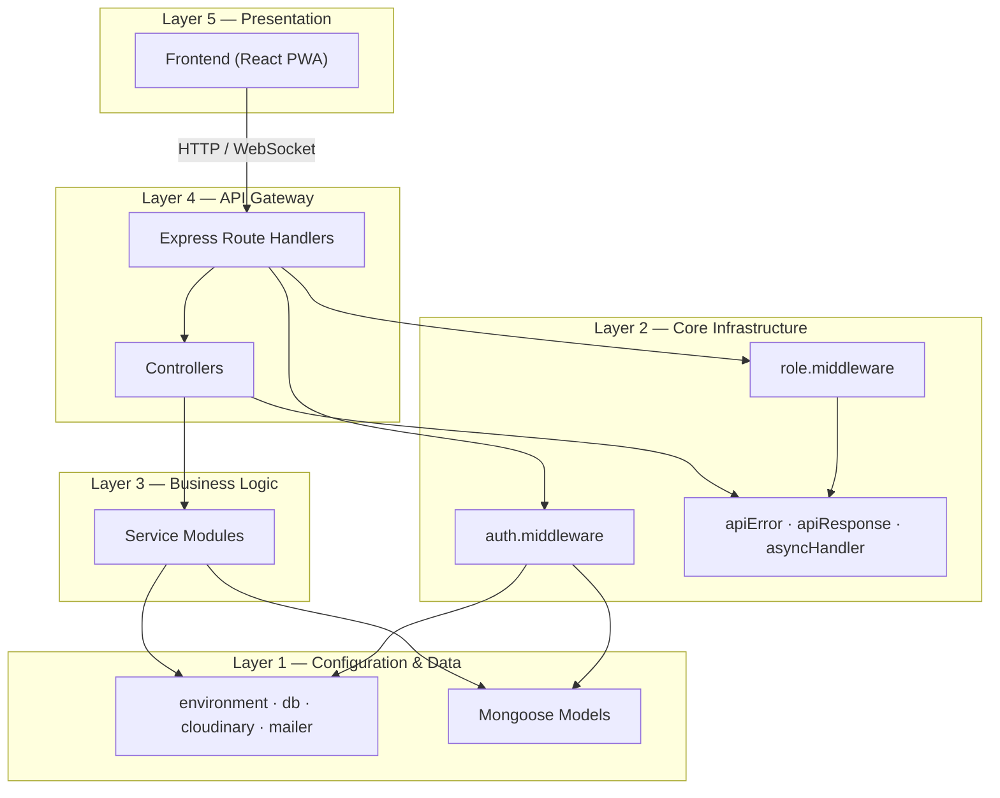
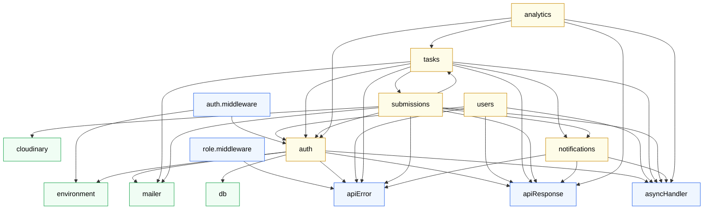
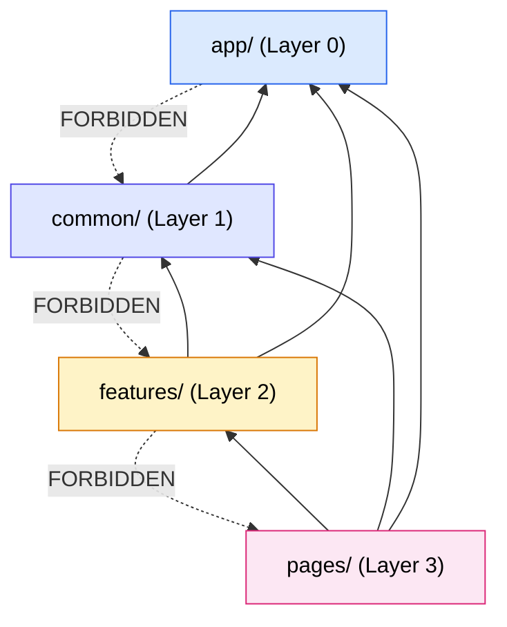
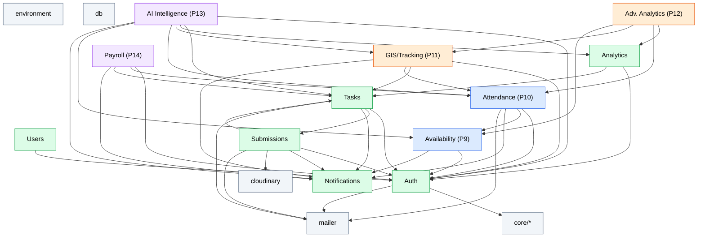
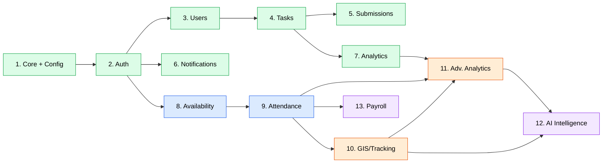
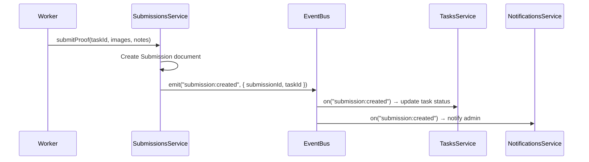

# Module Dependency Graph

## Smart Field Operations & Workforce Management System

> **Document 11 of 20** · Enterprise Architecture Series
>
> Cross-references: [Enterprise Architecture Blueprint](./09-Enterprise-Architecture-Blueprint.md) · [Domain-Driven Design](./10-Domain-Driven-Design.md) · [Implementation Phases v2](./18-Implementation-Phases-v2.md)

---

## 1. Document Purpose

This document maps every module in the Smart Field Operations system — current and planned — and traces the exact dependency edges between them. It serves three critical purposes:

1. **Architectural guardrails** — preventing circular dependencies and enforcing the one-way dependency rule established in [04-Architecture.md](./04-Architecture.md).
2. **Implementation sequencing** — defining the strict order in which future modules must be built, based on which data and services each one requires.
3. **Microservice extraction readiness** — identifying which modules can be cleanly separated if horizontal scaling demands it (see [Enterprise Architecture Blueprint §8](./09-Enterprise-Architecture-Blueprint.md)).

---

## 2. System Layers

Before examining individual modules, it is essential to understand the layered dependency hierarchy. Layers are ordered from bottom (lowest-level) to top (highest-level). A layer may depend on layers below it but **never** on layers above it.



---

## 3. Current Module Inventory (Phases 1–8)

### 3.1 Configuration Layer

| Module | Path | Files | Purpose | External Packages |
|--------|------|-------|---------|-------------------|
| **environment** | `config/environment.js` | 1 | Loads and validates environment variables | `dotenv` |
| **db** | `config/db.js` | 1 | MongoDB connection via Mongoose | `mongoose` |
| **cloudinary** | `config/cloudinary.js` | 1 | Cloudinary SDK setup and signed upload payload generation | `cloudinary` |
| **mailer** | `config/mailer.js` | 1 | Nodemailer transporter factory | `nodemailer` |

### 3.2 Core Layer

| Module | Path | Files | Purpose | Internal Dependencies |
|--------|------|-------|---------|----------------------|
| **apiError** | `core/utils/apiError.js` | 1 | Custom error class for HTTP errors | None |
| **apiResponse** | `core/utils/apiResponse.js` | 1 | JSend-formatted response helper | None |
| **asyncHandler** | `core/utils/asyncHandler.js` | 1 | Express async wrapper to catch promise rejections | None |
| **auth.middleware** | `core/middlewares/auth.middleware.js` | 1 | JWT verification, attaches `req.user` | `auth.model`, `environment`, `apiError`, `jsonwebtoken` |
| **role.middleware** | `core/middlewares/role.middleware.js` | 1 | Role-based access control guard | `apiError` |

### 3.3 Feature Modules

| Module | Path | Files | Purpose | Phase Introduced |
|--------|------|-------|---------|------------------|
| **auth** | `modules/auth/` | 6 | Registration, login, JWT issuance, session validation | Phase 1 |
| **users** | `modules/users/` | 4 | User listing, profile updates, role/status management | Phase 2 / Phase 8 |
| **tasks** | `modules/tasks/` | 5 | Task CRUD, assignment, status transitions, verification | Phase 2 |
| **submissions** | `modules/submissions/` | 5 | Proof-of-work upload, Cloudinary integration | Phase 4 |
| **notifications** | `modules/notifications/` | 4 | Persistent notification records, Socket.IO push | Phase 6 |
| **analytics** | `modules/analytics/` | 3 | Aggregation pipelines for KPIs and worker statistics | Phase 7 |

---

## 4. Current Module — Detailed Dependency Analysis

### 4.1 Auth Module

```
modules/auth/
├── auth.model.js          → mongoose
├── auth.validation.js     → zod
├── auth.service.js        → auth.model, apiError, environment, mailer (sendEmail)
├── auth.controller.js     → auth.service, auth.validation, apiError, asyncHandler, apiResponse
├── auth.routes.js         → auth.controller, auth.middleware, express-rate-limit
└── auth.seeder.js         → auth.model, db, environment, bcryptjs
```

**Depends on:** `config/environment`, `config/mailer`, `config/db`, `core/utils/*`, `core/middlewares/auth.middleware`

**Depended on by:** `users` (re-exports `auth.model`), `tasks` (reads User documents), `submissions` (reads User documents), `analytics` (reads User documents), `core/middlewares/auth.middleware` (reads `auth.model`)

> **Architectural Note:** The `auth.model.js` file defines the `User` Mongoose schema. This is the single source of truth for user data. The `users` module re-exports it via `users.model.js → require('../auth/auth.model')`. Other modules import it directly from `auth.model` rather than going through `users.service` — this is a known violation of the Rule of Isolation documented in [04-Architecture.md §8](./04-Architecture.md). Future refactoring should route cross-module data access through service functions.

### 4.2 Users Module

```
modules/users/
├── users.model.js         → re-exports auth.model (shared User schema)
├── users.service.js       → users.model, bcryptjs, apiError
├── users.controller.js    → users.service, apiError, asyncHandler, apiResponse
└── users.routes.js        → users.controller, auth.middleware, role.middleware
```

**Depends on:** `auth` (model), `core/utils/*`, `core/middlewares/*`

**Depended on by:** None directly (other modules query the User model via `auth.model`)

### 4.3 Tasks Module

```
modules/tasks/
├── tasks.model.js         → mongoose
├── tasks.validation.js    → zod
├── tasks.service.js       → tasks.model, auth.model (User), submissions.model,
│                             notifications.service (createNotification), mailer (sendEmail)
├── tasks.controller.js    → tasks.service, tasks.validation, apiError, asyncHandler, apiResponse
└── tasks.routes.js        → tasks.controller, auth.middleware, role.middleware
```

**Depends on:** `auth` (model), `submissions` (model), `notifications` (service), `config/mailer`, `core/*`

**Depended on by:** `submissions` (reads Task documents), `analytics` (aggregates Task collection)

> **Architectural Note:** `tasks.service.js` imports both `auth.model` directly (for user lookups during assignment) and `submissions.model` directly (for verification workflows). It also calls `notifications.service.createNotification()` — correctly using the service interface rather than the model. This mixed pattern should be standardized in future phases.

### 4.4 Submissions Module

```
modules/submissions/
├── submissions.model.js       → mongoose
├── submissions.validation.js  → zod
├── submissions.service.js     → submissions.model, tasks.model (Task), auth.model (User),
│                                 cloudinary (createSignedUploadPayload),
│                                 notifications.service (createNotification), mailer (sendEmail)
├── submissions.controller.js  → submissions.service, submissions.validation, apiError,
│                                 asyncHandler, apiResponse
└── submissions.routes.js      → submissions.controller, auth.middleware, role.middleware
```

**Depends on:** `auth` (model), `tasks` (model), `notifications` (service), `config/cloudinary`, `config/mailer`, `core/*`

**Depended on by:** `tasks` (reads Submission model for verification)

> **Mutual dependency detected:** `tasks.service` imports `submissions.model` and `submissions.service` imports `tasks.model`. This is a model-level cross-reference (not a circular service call), which is acceptable in a monolith but must be resolved before microservice extraction. See §9 for decoupling strategies.

### 4.5 Notifications Module

```
modules/notifications/
├── notifications.model.js       → mongoose
├── notifications.validation.js  → zod
├── notifications.service.js     → notifications.model, apiError
├── notifications.controller.js  → notifications.service, notifications.validation, apiError,
│                                   asyncHandler, apiResponse
└── notifications.routes.js      → notifications.controller, auth.middleware
```

**Depends on:** `core/utils/*`, `core/middlewares/auth.middleware`

**Depended on by:** `tasks` (calls `createNotification`), `submissions` (calls `createNotification`)

> **Architectural Note:** The notifications module is the cleanest module in the system. It has zero outbound feature dependencies — it only imports from `core/*`. Other modules depend inward on it through its service interface. This makes it an ideal candidate for future event-driven decoupling: instead of direct function calls, `tasks` and `submissions` would emit events that the notifications module subscribes to (see [14-Event-Driven-Architecture.md](./14-Event-Driven-Architecture.md)).

### 4.6 Analytics Module

```
modules/analytics/
├── analytics.service.js     → mongoose, tasks.model (Task), auth.model (User), apiError
├── analytics.controller.js  → analytics.service, asyncHandler, apiResponse
└── analytics.routes.js      → analytics.controller, auth.middleware, role.middleware
```

**Depends on:** `auth` (model), `tasks` (model), `core/*`

**Depended on by:** None

> **Architectural Note:** Analytics is a pure read-only consumer. It imports models to run aggregation pipelines but never writes to `tasks` or `users`. This unidirectional flow makes it the simplest module to extract into a separate read-replica service.

---

## 5. Current Dependency Graph



### 5.1 Dependency Direction Summary

| Source Module | Depends On |
|---------------|------------|
| **auth** | `environment`, `mailer`, `db`, `core/*` |
| **users** | `auth` (model re-export), `core/*` |
| **tasks** | `auth` (model), `submissions` (model), `notifications` (service), `mailer`, `core/*` |
| **submissions** | `auth` (model), `tasks` (model), `notifications` (service), `cloudinary`, `mailer`, `core/*` |
| **notifications** | `core/*` only |
| **analytics** | `auth` (model), `tasks` (model), `core/*` |

### 5.2 Afferent and Efferent Coupling

| Module | Afferent (depended on by) | Efferent (depends on) | Instability* |
|--------|---------------------------|----------------------|-------------|
| **auth** | 5 (users, tasks, subs, analytics, auth.middleware) | 3 (environment, mailer, db) | 0.38 |
| **users** | 0 | 1 (auth) | 1.00 |
| **tasks** | 2 (submissions, analytics) | 4 (auth, subs, notif, mailer) | 0.67 |
| **submissions** | 1 (tasks) | 5 (auth, tasks, notif, cloudinary, mailer) | 0.83 |
| **notifications** | 2 (tasks, submissions) | 0 | 0.00 |
| **analytics** | 0 | 2 (auth, tasks) | 1.00 |

*\*Instability = Efferent / (Afferent + Efferent). Values near 0 indicate stable, foundational modules. Values near 1 indicate volatile, peripheral modules. Stable modules should be abstract (interfaces); volatile modules should be concrete (implementations).*

**Key insight:** The `notifications` module (instability = 0.00) is the most stable feature module — it has zero outbound dependencies. The `auth` module (instability = 0.38) is the most depended-upon. Both are correct positions for their responsibilities.

---

## 6. Frontend Module Structure

### 6.1 Frontend Layer Hierarchy

```
frontend/src/
├── app/                    ← Layer 0: Global singletons
│   ├── api.js              (Axios instance, interceptors)
│   ├── auth-context.jsx    (AuthProvider, useAuth hook)
│   ├── socket.js           (Socket.IO client instance)
│   └── theme-context.jsx   (ThemeProvider, useTheme hook)
│
├── common/                 ← Layer 1: Shared, reusable elements
│   ├── components/
│   │   ├── NotificationDropdown.jsx
│   │   ├── ProtectedRoute.jsx
│   │   └── ThemeSwitcher.jsx
│   └── layouts/
│       ├── AdminLayout.jsx
│       └── WorkerLayout.jsx
│
├── features/               ← Layer 2: Domain-specific components
│   ├── analytics/
│   ├── auth/
│   ├── submissions/
│   └── tasks/
│
├── pages/                  ← Layer 3: Route-level composition
│   ├── Home.jsx
│   ├── Settings.jsx
│   ├── admin/
│   └── worker/
│
└── App.jsx                 ← Root: composes all layers
```

### 6.2 Frontend Dependency Rules



**Rules enforced:**
- `pages/` may import from any lower layer
- `features/` may import from `common/` and `app/`, never from `pages/`
- `common/` may import from `app/`, never from `features/`
- `app/` has zero internal imports (standalone singletons)

---

## 7. Future Module Inventory (Phases 9–14)

### 7.1 Phase 9 — Availability Module

| Attribute | Detail |
|-----------|--------|
| **Path** | `modules/availability/` |
| **Planned files** | `availability.model.js`, `availability.validation.js`, `availability.service.js`, `availability.controller.js`, `availability.routes.js` |
| **Models** | `WorkerAvailability`, `LeaveRequest` |
| **Depends on** | `auth` (User model for worker reference), `notifications` (leave request alerts), `core/*` |
| **Depended on by** | `attendance` (checks if worker should be on duty), `tasks` (smart assignment considers availability), `ai-intelligence` (availability patterns) |
| **New packages** | None |

### 7.2 Phase 10 — Attendance Module

| Attribute | Detail |
|-----------|--------|
| **Path** | `modules/attendance/` |
| **Planned files** | `attendance.model.js`, `attendance.validation.js`, `attendance.service.js`, `attendance.controller.js`, `attendance.routes.js`, `shifts.model.js` |
| **Models** | `AttendanceRecord`, `Shift` |
| **Depends on** | `auth` (User), `availability` (check scheduled windows), `notifications` (late/absent alerts), `config/mailer`, `core/*` |
| **Depended on by** | `analytics` (attendance metrics), `ai-intelligence` (attendance patterns), `payroll` (hours calculation) |
| **New packages** | None |

### 7.3 Phase 11 — GIS & Live Tracking Module

| Attribute | Detail |
|-----------|--------|
| **Path** | `modules/tracking/` |
| **Planned files** | `location.model.js`, `geofence.model.js`, `route.model.js`, `tracking.validation.js`, `tracking.service.js`, `geofence.service.js`, `route.service.js`, `tracking.controller.js`, `tracking.routes.js` |
| **Models** | `WorkerLocation`, `Geofence`, `Route` |
| **Depends on** | `auth` (User), `tasks` (task locations for route optimization), `attendance` (auto check-in via geofence), `notifications` (geofence alerts), `core/*` |
| **Depended on by** | `analytics` (tracking heatmaps, distance metrics), `ai-intelligence` (movement pattern analysis) |
| **New packages** | `@turf/turf` (geospatial calculations), frontend: `leaflet` or `mapbox-gl`, `react-leaflet` |

### 7.4 Phase 12 — Advanced Analytics Module

| Attribute | Detail |
|-----------|--------|
| **Path** | `modules/advanced-analytics/` (extends existing `modules/analytics/`) |
| **Planned files** | `analytics-snapshot.model.js`, `analytics-cron.js`, extended `analytics.service.js` |
| **Models** | `AnalyticsSnapshot` |
| **Depends on** | `auth` (User), `tasks` (Task), `submissions` (Submission), `attendance` (AttendanceRecord), `tracking` (WorkerLocation, Route), `availability` (WorkerAvailability), `core/*` |
| **Depended on by** | `ai-intelligence` (historical data for ML features) |
| **New packages** | `node-cron` (scheduled snapshot generation), frontend: `chart.js`, `react-chartjs-2` or `d3` |

### 7.5 Phase 13 — AI Workforce Intelligence Module

| Attribute | Detail |
|-----------|--------|
| **Path** | `modules/ai-intelligence/` |
| **Planned files** | `recommendation.model.js`, `ai-models.model.js`, `ai.service.js`, `ai.controller.js`, `ai.routes.js`, `prediction.service.js`, `assignment-optimizer.service.js` |
| **Models** | `AIRecommendation`, `AIModel` |
| **Depends on** | `auth` (User), `tasks` (Task), `analytics` (AnalyticsSnapshot), `tracking` (WorkerLocation), `attendance` (AttendanceRecord), `availability` (WorkerAvailability), `notifications` (recommendation alerts), `core/*` |
| **Depended on by** | `tasks` (optional smart assignment integration) |
| **New packages** | `openai` (GPT API), optionally `@tensorflow/tfjs` (local ML inference) |

### 7.6 Phase 14 — Payroll Module

| Attribute | Detail |
|-----------|--------|
| **Path** | `modules/payroll/` |
| **Planned files** | `payroll.model.js`, `payroll.validation.js`, `payroll.service.js`, `payroll.controller.js`, `payroll.routes.js` |
| **Models** | `PayrollEntry` |
| **Depends on** | `auth` (User), `attendance` (hours worked), `tasks` (task-based bonuses), `notifications` (payroll notifications), `core/*` |
| **Depended on by** | None (terminal leaf module) |
| **New packages** | None initially; future: payment gateway SDK |

---

## 8. Complete Dependency Graph (Current + Future)



### 8.1 Legend

| Color | Meaning |
|-------|---------|
| 🟢 Green | Current modules (Phases 1–8) — Implemented and stable |
| 🔵 Blue | Phases 9–10 — Availability and Attendance |
| 🟠 Orange | Phases 11–12 — Live Tracking and Advanced Analytics |
| 🟣 Purple | Phases 13–14 — AI Intelligence and Payroll |
| ⬜ Grey | Configuration and core infrastructure |

---

## 9. Implementation Order (Topological Sort)

The following order respects all dependency edges. A module may only be implemented after every module it depends on is complete.



### 9.1 Ordering Rationale

| Order | Module | Why This Position |
|-------|--------|-------------------|
| **1** | Core + Config | Foundation. Every module imports `apiError`, `asyncHandler`, `apiResponse`. No features work without database connectivity (`db.js`) and environment loading (`environment.js`). |
| **2** | Auth | Identity is the prerequisite for everything. JWT issuance, password hashing, and the `User` model must exist before any module can authenticate or reference users. |
| **3** | Users | Extends `auth` with profile management and worker listing. Required for task assignment dropdowns. |
| **4** | Tasks | Core business entity. Requires `auth` (model) for assignee references and `users` service for worker lookups. |
| **5** | Submissions | Proof-of-work lifecycle. Requires `tasks` (model) to link proofs to work orders, and `auth` (model) for worker identity verification. |
| **6** | Notifications | Cross-cutting concern. Has zero outbound feature dependencies by design. Placed here because `tasks` and `submissions` call its service — but it was actually implemented in Phase 6 alongside Socket.IO, after submissions were stable. |
| **7** | Analytics | Read-only aggregator. Requires stable `tasks` and `auth` collections to run meaningful pipelines. No module depends on analytics at this stage. |
| **8** | Availability *(Phase 9)* | First new domain module. Depends only on `auth` (User model) and `notifications`. Must precede Attendance because attendance validation checks whether a worker was scheduled to work. |
| **9** | Attendance *(Phase 10)* | Depends on `availability` (scheduled hours) and `auth` (User). Must precede Tracking because geofence-based auto check-in requires the attendance system to exist. Must precede Payroll because pay calculation requires logged hours. |
| **10** | GIS/Tracking *(Phase 11)* | Depends on `auth`, `tasks` (for location-aware assignment), and `attendance` (for geofence-triggered check-ins). Introduces the high-frequency `WorkerLocations` collection. |
| **11** | Advanced Analytics *(Phase 12)* | Depends on ALL preceding data modules — it aggregates across `tasks`, `attendance`, `tracking`, and `availability` to produce enterprise-grade KPIs and historical snapshots. |
| **12** | AI Intelligence *(Phase 13)* | The most dependent module. Requires historical analytics data, live tracking feeds, attendance patterns, and availability schedules to generate meaningful recommendations. This is why it cannot be built before Phase 12. |
| **13** | Payroll *(Phase 14)* | Terminal leaf. Depends primarily on `attendance` (hours worked) and `tasks` (performance bonuses). Intentionally last because the project's core value proposition is operational intelligence, not HR/Finance — see [Enterprise Architecture Blueprint §3](./09-Enterprise-Architecture-Blueprint.md). |

---

## 10. Dependency Matrix

A cross-reference table showing which modules depend on which. Read as: **Row depends on Column**.

### 10.1 Current Modules

|  | auth | users | tasks | submissions | notifications | analytics | environment | db | cloudinary | mailer |
|--|------|-------|-------|-------------|---------------|-----------|-------------|-----|------------|--------|
| **auth** | — | | | | | | ✕ | ✕ | | ✕ |
| **users** | ✕ | — | | | | | | | | |
| **tasks** | ✕ | | — | ✕ (model) | ✕ (service) | | | | | ✕ |
| **submissions** | ✕ | | ✕ (model) | — | ✕ (service) | | | | ✕ | ✕ |
| **notifications** | | | | | — | | | | | |
| **analytics** | ✕ | | ✕ (model) | | | — | | | | |

### 10.2 Future Modules

|  | auth | tasks | submissions | notifications | analytics | availability | attendance | tracking | adv-analytics |
|--|------|-------|-------------|---------------|-----------|-------------|------------|----------|---------------|
| **availability** | ✕ | | | ✕ | | — | | | |
| **attendance** | ✕ | | | ✕ | | ✕ | — | | |
| **tracking** | ✕ | ✕ | | ✕ | | | ✕ | — | |
| **adv-analytics** | | | | | ✕ | ✕ | ✕ | ✕ | — |
| **ai-intelligence** | ✕ | ✕ | | ✕ | ✕ | ✕ | ✕ | ✕ | |
| **payroll** | ✕ | ✕ | | ✕ | | | ✕ | | |

---

## 11. Circular Dependency Prevention

### 11.1 Current Violations

There is one known model-level circular reference in the current codebase:

```
tasks.service.js  →  imports  →  submissions.model (Submission)
submissions.service.js  →  imports  →  tasks.model (Task)
```

This is **not** a circular service dependency (neither service calls functions from the other service). It is a data access pattern where both modules need to read each other's collections. In a monolithic application with a shared database, this is tolerable because Mongoose models are singletons — the circular `require()` resolves without deadlock in Node.js.

### 11.2 Prevention Rules

To prevent true circular dependencies as the system grows:

| Rule | Description |
|------|-------------|
| **R1: One-way service calls** | Module A may call `moduleB.service.functionName()`, but if it does, Module B must **never** call `moduleA.service.*()`. If both need to communicate, use events. |
| **R2: Model imports are read-only** | Importing another module's model is permitted only for **read** operations (queries, aggregation). Write operations on foreign collections must go through the owning module's service. |
| **R3: Event-based decoupling** | When two modules need bidirectional communication, introduce domain events. Module A emits an event; Module B subscribes. Neither directly imports the other. See [14-Event-Driven-Architecture.md](./14-Event-Driven-Architecture.md). |
| **R4: Shared Kernel minimization** | The `auth.model` (User schema) is a de facto shared kernel. No other model should become a shared kernel. Future cross-module data access should route through services or events. |
| **R5: No transitive feature imports** | A module must not import from Module B solely because Module B imports from Module C. If Module A needs data from Module C, it should import Module C directly or use an event. |

### 11.3 Event-Based Decoupling Strategy

The tasks ↔ submissions circular model import should be resolved in Phase 12 using the internal event bus:



With this pattern, `submissions.service.js` no longer needs to import `tasks.model` — it simply emits an event and the `tasks` module reacts independently.

---

## 12. Frontend Future Module Projections

### 12.1 New Feature Directories

| Phase | Frontend Feature Path | Key Components |
|-------|----------------------|----------------|
| Phase 9 | `features/availability/` | `AvailabilityCalendar.jsx`, `LeaveRequestForm.jsx`, `AvailabilityGrid.jsx` |
| Phase 10 | `features/attendance/` | `CheckInButton.jsx`, `AttendanceLog.jsx`, `ShiftManager.jsx`, `AttendanceReport.jsx` |
| Phase 11 | `features/tracking/` | `LiveMap.jsx`, `GeofenceEditor.jsx`, `WorkerTrail.jsx`, `RouteOptimizer.jsx` |
| Phase 12 | `features/analytics/` (extended) | `AnalyticsCharts.jsx`, `SnapshotComparison.jsx`, `HeatmapOverlay.jsx` |
| Phase 13 | `features/ai/` | `AIRecommendationCard.jsx`, `SmartAssignmentPanel.jsx`, `AIChatAssistant.jsx`, `PredictionAlert.jsx` |
| Phase 14 | `features/payroll/` | `PayrollSummary.jsx`, `PayslipDetail.jsx`, `PayrollApproval.jsx` |

### 12.2 New Page Directories

| Phase | Pages |
|-------|-------|
| Phase 9 | `pages/admin/AvailabilityManagement.jsx`, `pages/worker/MyAvailability.jsx` |
| Phase 10 | `pages/admin/AttendanceDashboard.jsx`, `pages/worker/CheckIn.jsx` |
| Phase 11 | `pages/admin/LiveTrackingDashboard.jsx`, `pages/admin/GeofenceManager.jsx` |
| Phase 12 | `pages/admin/AdvancedAnalytics.jsx` |
| Phase 13 | `pages/admin/AIInsights.jsx`, `pages/admin/SmartDispatch.jsx` |
| Phase 14 | `pages/admin/PayrollDashboard.jsx`, `pages/worker/MyPayslips.jsx` |

---

## 13. Dependency Governance Checklist

Before merging any new module, verify:

- [ ] **No upward layer imports** — the module does not import from a higher architectural layer
- [ ] **No circular service calls** — if Module A calls Module B's service, B does not call A's service
- [ ] **Model imports are read-only** — foreign models are queried, never written to directly
- [ ] **Notifications via service interface** — `createNotification()` is called through the service function, not by directly inserting into the Notification model
- [ ] **Route middleware applied** — `protect` and `requireRoles()` are correctly applied per the [Role Permission Matrix](./13-Role-Permission-Matrix.md)
- [ ] **No config leakage** — environment variables are accessed only through `config/environment.js`, never via `process.env` directly in feature modules
- [ ] **Frontend layer rules respected** — `features/` never imports from `pages/`, `common/` never imports from `features/`

---

## 14. Summary

The Smart Field Operations system currently comprises **6 feature modules**, **4 configuration modules**, and **5 core utilities**, with a frontend organized across **4 architectural layers**. The dependency graph reveals a well-structured system with one known model-level circular reference (`tasks ↔ submissions`) that is architecturally contained and scheduleded for event-based decoupling in Phase 12.

The future roadmap introduces **6 additional modules** across Phases 9–14. Each module has been positioned in the implementation order based on strict topological sorting of its dependency edges. The critical path runs:

**Auth → Availability → Attendance → GIS/Tracking → Advanced Analytics → AI Intelligence**

Payroll sits as an optional terminal node, deliberately delayed to keep the platform focused on its core differentiator: operational intelligence through real-time tracking and AI-powered workforce optimization.

---

*Last updated: July 2026 · Next review: Prior to Phase 9 implementation*
