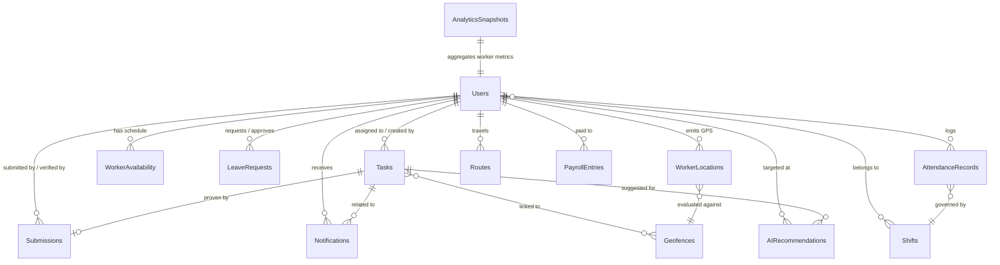

# Database Evolution

## Smart Field Operations & Workforce Management System

> **Document 12 of 20** · Enterprise Architecture Series
>
> Cross-references: [Domain-Driven Design](./10-Domain-Driven-Design.md) · [Module Dependencies](./11-Module-Dependency-Graph.md) · [Implementation Phases v2](./18-Implementation-Phases-v2.md)

---

## 1. Purpose

This document describes how the MongoDB schema evolves from Phases 9–14 without breaking or migrating existing collections. Every future phase **adds** new collections alongside the current ones. Existing documents are never restructured — only extended with optional fields where necessary.

---

## 2. Current Collections (Phases 1–8)

| Collection | Purpose | Key Fields | Relationships |
|------------|---------|------------|---------------|
| **Users** | Identity, authentication, RBAC | `name`, `email`, `password`, `role` (admin/worker/dispatcher), `status` (active/on-leave/inactive), `avatarUrl`, `phone`, `refreshToken` | Referenced by Tasks, Submissions, Notifications |
| **Tasks** | Core work orders | `title`, `description`, `priority`, `deadline`, `locationAddress`, `locationCoordinates` (GeoJSON), `assignedTo` → User, `createdBy` → User, `status` | References Users; referenced by Submissions |
| **Submissions** | Proof of work | `taskId` → Task, `workerId` → User, `images[]`, `notes`, `submittedLocation` (GeoJSON), `isVerified`, `verifiedBy` → User, `verificationFeedback` | References Tasks and Users |
| **Notifications** | User alerts (persistent + Socket.IO) | `userId` → User, `message`, `type`, `relatedTaskId` → Task, `isRead` | References Users and Tasks |

> **Note:** There is no separate RefreshTokens collection. The refresh token is stored as a field on the Users document (`refreshToken: String, select: false`).

---

## 3. Future Collections

### Phase 9 — Availability Management

#### WorkerAvailability

| Attribute | Detail |
|-----------|--------|
| **Purpose** | Recurring weekly schedule windows per worker |
| **Key fields** | `workerId` → User, `dayOfWeek` (0–6), `startTime` (HH:mm), `endTime` (HH:mm), `isRecurring`, `effectiveFrom`, `effectiveUntil` |
| **Relationships** | Many-to-One → Users |
| **Indexes** | `{ workerId: 1, dayOfWeek: 1 }` compound unique; `{ effectiveUntil: 1 }` for expiry queries |

#### LeaveRequests

| Attribute | Detail |
|-----------|--------|
| **Purpose** | Time-off requests with approval workflow |
| **Key fields** | `workerId` → User, `type` (sick/personal/vacation/emergency), `startDate`, `endDate`, `reason`, `status` (pending/approved/rejected), `approvedBy` → User |
| **Relationships** | Many-to-One → Users (worker + approver) |
| **Indexes** | `{ workerId: 1, startDate: 1 }`; `{ status: 1 }` |

---

### Phase 10 — Attendance Management

#### AttendanceRecords

| Attribute | Detail |
|-----------|--------|
| **Purpose** | Daily check-in/check-out log per worker |
| **Key fields** | `workerId` → User, `date`, `checkIn` (embedded: `time`, `location` GeoJSON, `method`), `checkOut` (embedded: same), `totalHours`, `status` (present/absent/late/half-day/on-leave), `overtime`, `approvedBy` → User |
| **Relationships** | Many-to-One → Users |
| **Indexes** | `{ workerId: 1, date: 1 }` compound unique; `{ date: 1, status: 1 }` |

#### Shifts

| Attribute | Detail |
|-----------|--------|
| **Purpose** | Reusable shift templates assigned to groups of workers |
| **Key fields** | `name`, `startTime`, `endTime`, `gracePeriodMinutes`, `workers[]` → Users, `isActive` |
| **Relationships** | Many-to-Many → Users |
| **Indexes** | `{ isActive: 1 }` |

---

### Phase 11 — Live Tracking

#### WorkerLocations

| Attribute | Detail |
|-----------|--------|
| **Purpose** | High-frequency GPS pings from worker devices |
| **Key fields** | `workerId` → User, `location` (GeoJSON Point), `accuracy` (meters), `speed` (km/h), `heading`, `batteryLevel`, `isMoving`, `timestamp` |
| **Relationships** | Many-to-One → Users |
| **Indexes** | `{ workerId: 1, timestamp: -1 }`; `{ location: "2dsphere" }`; `{ timestamp: 1 }` **TTL 7 days** |

> **Performance note:** This is the highest-write collection in the system. GPS pings arrive every 10–30 seconds per active worker. The TTL index auto-purges data older than 7 days. Historical routes are preserved in the Routes collection.

#### Geofences

| Attribute | Detail |
|-----------|--------|
| **Purpose** | Virtual boundaries for work sites, restricted zones, auto check-in zones |
| **Key fields** | `name`, `type` (work-site/restricted/check-in-zone), `boundary` (GeoJSON Polygon), `center` (GeoJSON Point), `radius`, `rules` (embedded: `autoCheckIn`, `alertOnExit`, `requiredDuration`), `linkedTasks[]` → Tasks, `isActive`, `createdBy` → User |
| **Relationships** | Many-to-Many → Tasks; Many-to-One → Users |
| **Indexes** | `{ boundary: "2dsphere" }`; `{ center: "2dsphere" }`; `{ isActive: 1 }` |

#### Routes

| Attribute | Detail |
|-----------|--------|
| **Purpose** | Consolidated daily travel path per worker (derived from WorkerLocations) |
| **Key fields** | `workerId` → User, `date`, `waypoints[]` (embedded: `location` GeoJSON, `timestamp`, `taskId`), `totalDistance` (km), `optimizedOrder[]` → Tasks |
| **Relationships** | Many-to-One → Users; references Tasks |
| **Indexes** | `{ workerId: 1, date: -1 }` compound unique |

---

### Phase 12 — Advanced Analytics

#### AnalyticsSnapshots

| Attribute | Detail |
|-----------|--------|
| **Purpose** | Pre-computed KPI snapshots for fast dashboard loading |
| **Key fields** | `type` (daily/weekly/monthly), `date`, `metrics` (embedded: `totalTasks`, `completed`, `pending`, `overdue`, `avgCompletionTime`, `avgDistanceTraveled`), `workerMetrics[]` (embedded: `workerId`, `tasksCompleted`, `avgTime`, `hoursWorked`, `distanceTraveled`) |
| **Relationships** | References Users within embedded worker metrics |
| **Indexes** | `{ type: 1, date: -1 }` compound unique |

---

### Phase 13 — AI Workforce Intelligence

#### AIRecommendations

| Attribute | Detail |
|-----------|--------|
| **Purpose** | AI-generated suggestions stored for admin review, acceptance tracking, and model feedback |
| **Key fields** | `type` (assignment/route/schedule/alert), `targetUserId` → User, `targetTaskId` → Task, `recommendation`, `confidence` (0–1), `reasoning`, `status` (pending/accepted/rejected/expired), `feedback`, `modelVersion` |
| **Relationships** | Many-to-One → Users; Many-to-One → Tasks |
| **Indexes** | `{ type: 1, status: 1 }`; `{ targetUserId: 1, createdAt: -1 }`; `{ createdAt: 1 }` TTL 90 days |

---

### Phase 14 — Payroll (Optional)

#### PayrollEntries

| Attribute | Detail |
|-----------|--------|
| **Purpose** | Calculated pay records per worker per period |
| **Key fields** | `workerId` → User, `period` (embedded: `startDate`, `endDate`), `regularHours`, `overtimeHours`, `tasksCompleted`, `baseRate`, `overtimeRate`, `bonuses[]` (embedded: `type`, `amount`, `reason`), `deductions[]` (embedded), `grossPay`, `netPay`, `status` (draft/calculated/approved/paid), `approvedBy` → User |
| **Relationships** | Many-to-One → Users |
| **Indexes** | `{ workerId: 1, "period.startDate": 1 }` compound unique; `{ status: 1 }` |

---

## 4. Collection Relationship Diagram

---

## 5. Index Strategy

### Current Collections

| Collection | Index | Type | Purpose |
|------------|-------|------|---------|
| **Users** | `{ email: 1 }` | Unique | Login lookups |
| **Users** | `{ role: 1, status: 1 }` | Compound | Worker listing for assignment |
| **Tasks** | `{ assignedTo: 1, status: 1 }` | Compound | Worker dashboard queries |
| **Tasks** | `{ status: 1, deadline: 1 }` | Compound | Admin overdue/pending queries |
| **Tasks** | `{ locationCoordinates: "2dsphere" }` | Geospatial | Nearest-task queries |
| **Submissions** | `{ taskId: 1 }` | Standard | Proof lookup by task |
| **Submissions** | `{ workerId: 1, createdAt: -1 }` | Compound | Worker submission history |
| **Notifications** | `{ userId: 1, isRead: 1 }` | Compound | Unread notification badge |
| **Notifications** | `{ createdAt: 1 }` | TTL (30 days) | Auto-purge old notifications |

### Future Collections

| Collection | Index | Type | Purpose |
|------------|-------|------|---------|
| **WorkerAvailability** | `{ workerId: 1, dayOfWeek: 1 }` | Compound unique | One entry per worker per day |
| **LeaveRequests** | `{ workerId: 1, startDate: 1 }` | Compound | Date-range overlap checks |
| **AttendanceRecords** | `{ workerId: 1, date: 1 }` | Compound unique | One record per worker per day |
| **AttendanceRecords** | `{ date: 1, status: 1 }` | Compound | Daily attendance reports |
| **Shifts** | `{ isActive: 1 }` | Standard | Active shift lookups |
| **WorkerLocations** | `{ workerId: 1, timestamp: -1 }` | Compound | Latest location per worker |
| **WorkerLocations** | `{ location: "2dsphere" }` | Geospatial | Nearest-worker queries |
| **WorkerLocations** | `{ timestamp: 1 }` | TTL (7 days) | Auto-purge raw GPS data |
| **Geofences** | `{ boundary: "2dsphere" }` | Geospatial | Point-in-polygon checks |
| **Geofences** | `{ center: "2dsphere" }` | Geospatial | Radius-based lookups |
| **Routes** | `{ workerId: 1, date: -1 }` | Compound unique | Daily route lookup |
| **AnalyticsSnapshots** | `{ type: 1, date: -1 }` | Compound unique | Dashboard KPI retrieval |
| **AIRecommendations** | `{ type: 1, status: 1 }` | Compound | Pending recommendations |
| **AIRecommendations** | `{ createdAt: 1 }` | TTL (90 days) | Auto-purge stale suggestions |
| **PayrollEntries** | `{ workerId: 1, "period.startDate": 1 }` | Compound unique | One entry per worker per period |

---

## 6. Migration Strategy

### Guiding Principle

Every phase uses **additive-only** schema changes. No existing collection is renamed, restructured, or dropped.

### Phase-by-Phase Approach

| Phase | Strategy |
|-------|----------|
| **Phase 9** | Create `workeravailabilities` and `leaverequests` collections. No changes to existing collections. Workers without availability records are treated as "always available" for backward compatibility. |
| **Phase 10** | Create `attendancerecords` and `shifts` collections. Add optional `shiftId` field to Users document (not required — workers without a shift use default hours). No backfill needed. |
| **Phase 11** | Create `workerlocations`, `geofences`, and `routes` collections. The `locationCoordinates` 2dsphere index on Tasks already exists. No existing schema changes. |
| **Phase 12** | Create `analyticssnapshots` collection. The existing `analytics.service.js` continues to run live aggregation pipelines. Snapshots supplement live data for historical comparison — they do not replace the existing analytics module. |
| **Phase 13** | Create `airecommendations` collection. Add optional `aiScore` field to Tasks for ranked assignment suggestions. Existing task assignment continues to work without AI scores. |
| **Phase 14** | Create `payrollentries` collection. Add optional `hourlyRate` and `overtimeRate` fields to Users. Workers without rates are excluded from payroll calculation — no breakage. |

### Backward Compatibility Rules

- New fields on existing collections are always **optional** with sensible defaults
- No existing field is renamed or removed
- No existing index is dropped
- Application code checks for field existence before using it (`if (user.hourlyRate) { ... }`)
- No data backfill scripts are required for any phase

---

## 7. Database Scaling Strategy

### Indexing

- Every query that appears in a list view, dashboard, or API filter **must** have a covering compound index
- Use `explain()` during development to verify index usage on all new queries
- Avoid single-field indexes when a compound index already covers the field

### TTL Collections

| Collection | TTL | Rationale |
|------------|-----|-----------|
| Notifications | 30 days | Prevents unbounded growth; old alerts have no value |
| WorkerLocations | 7 days | Raw GPS pings are consolidated into Routes daily; keeping raw data beyond 7 days wastes storage |
| AIRecommendations | 90 days | Expired/rejected suggestions have no operational value |

### Archiving

- **AnalyticsSnapshots** serve as the long-term archive — they summarize raw data that can be safely TTL'd
- **Routes** are the permanent archive of WorkerLocations — one document per worker per day instead of thousands of GPS pings
- Tasks and Submissions are never TTL'd — they are the legal record of work performed

### Read-Heavy Analytics

- AnalyticsSnapshots provide pre-computed metrics so the admin dashboard does not run expensive aggregation pipelines on every page load
- Live aggregation is reserved for real-time widgets; historical charts read from snapshots
- Future: MongoDB read replicas for analytics queries to avoid impacting write performance

### Future Sharding

- **Shard key candidate for WorkerLocations:** `{ workerId: 1 }` (hashed) — ensures even distribution across shards since queries always filter by worker
- **Shard key candidate for Tasks:** `{ createdBy: 1 }` (hashed) — distributes load across organizations in a future multi-tenant scenario
- Sharding is not required until the system exceeds ~100 concurrent field workers or ~1M documents in WorkerLocations

---

## 8. Future Considerations

- **Multi-tenancy:** Add an `organizationId` field to Users and Tasks when supporting multiple companies. All indexes must include `organizationId` as the first key.
- **Field-level encryption:** `password` and `refreshToken` are already excluded from default queries via `select: false`. Future sensitive fields (hourly rates, pay amounts) should follow the same pattern.
- **Change streams:** MongoDB change streams can replace polling for real-time dashboard updates, complementing the Socket.IO layer.
- **Atlas Search:** Full-text search across task titles, descriptions, and notes can be offloaded to Atlas Search indexes rather than `$regex` queries.
- **Time-series collections:** MongoDB 5.0+ time-series collections are ideal for WorkerLocations — they optimize storage and query performance for timestamp-ordered data. Evaluate during Phase 11 implementation.

---

*Last updated: July 2026 · Next review: Prior to Phase 9 implementation*
