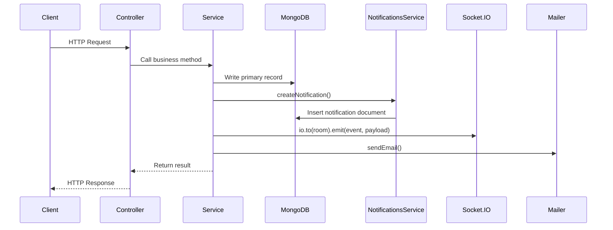
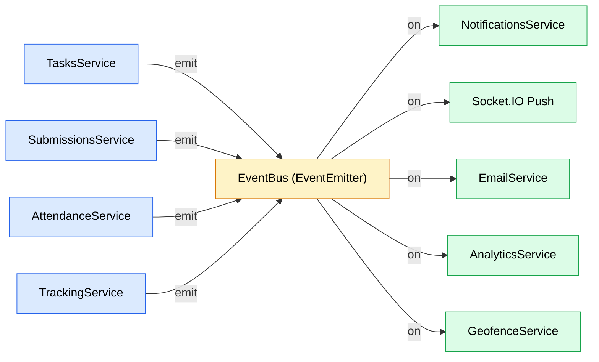
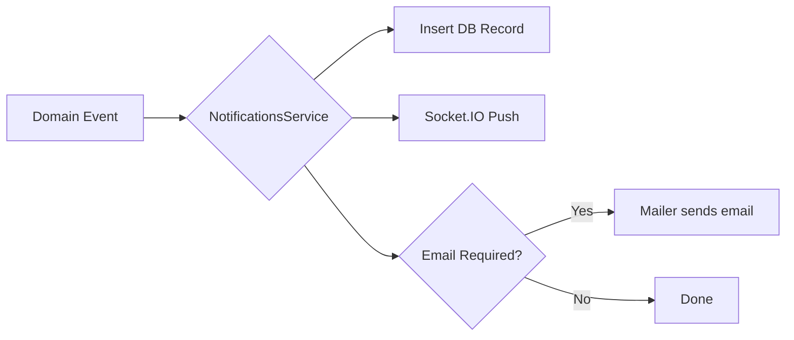
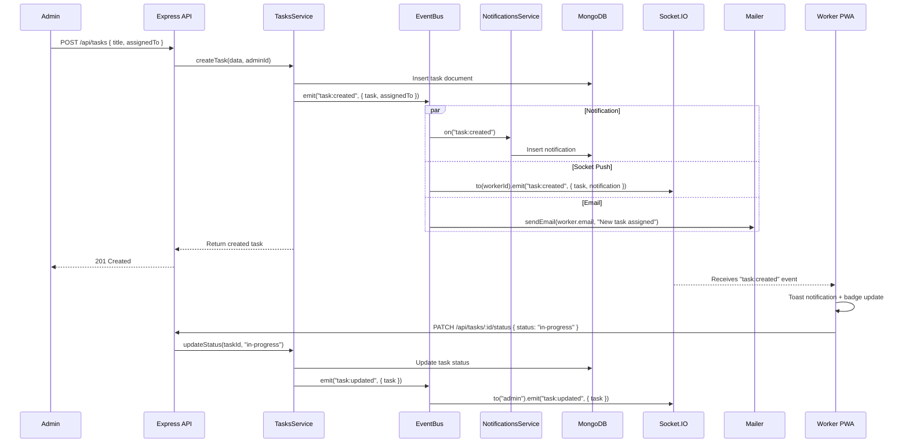
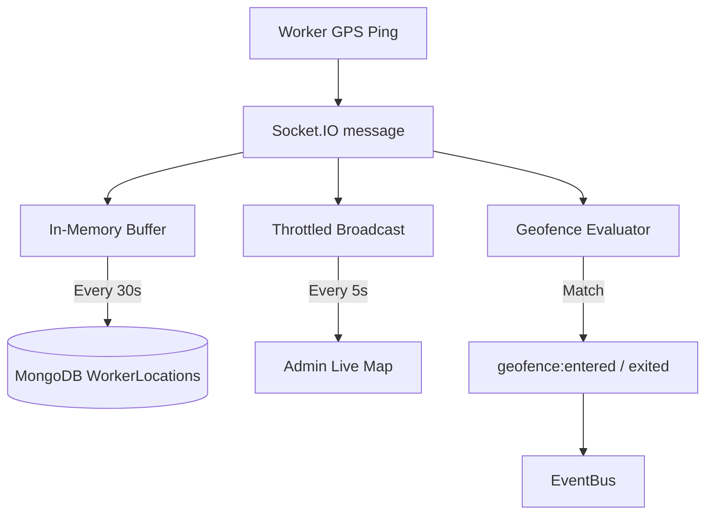

# Event-Driven Architecture

## Smart Field Operations & Workforce Management System

> **Document 14 of 20** · Enterprise Architecture Series
>
> Cross-references: [Module Dependencies](./11-Module-Dependency-Graph.md) · [Database Evolution](./12-Database-Evolution.md) · [Role Permission Matrix](./13-Role-Permission-Matrix.md)

---

## 1. Purpose

Define every domain event in the system — current and future — with publishers, subscribers, payloads, and transport. The existing platform uses **Socket.IO** for client-push and **direct service calls** for backend orchestration. This document extends that foundation with an internal **domain event layer** that decouples modules without introducing external infrastructure.

### Transport Evolution

| Phase | Transport | Scope |
|-------|-----------|-------|
| Phases 1–8 (current) | Direct service calls + Socket.IO | Monolith, single process |
| Phases 9–11 | Node.js `EventEmitter` bus + Socket.IO | Monolith, decoupled modules |
| Phases 12–13 | Redis Pub/Sub + Socket.IO Redis adapter | Horizontal scaling ready |
| Phase 14+ | Optional message queue | Guaranteed delivery if needed |

---

## 2. Current Events (Phases 1–8)

These events are already implemented via Socket.IO emit calls inside service functions.

| Event | Publisher | Subscriber(s) | Payload | Trigger |
|-------|-----------|----------------|---------|---------|
| `task:created` | `tasks.service` | Worker's Socket room, `NotificationDropdown` | `{ task, notification }` | Admin/Dispatcher creates and assigns a task |
| `submission:created` | `submissions.service` | Admin Socket room, `NotificationDropdown` | `{ submission, task }` | Worker submits proof of work |
| `task:verified` | `tasks.service` | Worker's Socket room, `NotificationDropdown` | `{ task, notification }` | Admin approves or rejects a submission |

### Current Flow Pattern

> **Problem with current approach:** The service function is tightly coupled to notifications, Socket.IO, and email. Adding a new subscriber (e.g., analytics update) means editing the service function. The event bus pattern in §4 solves this.

---

## 3. Future Events

### Phase 9 — Availability

| Event | Publisher | Subscriber(s) | Payload | Trigger |
|-------|-----------|----------------|---------|---------|
| `availability:updated` | `availability.service` | DispatchBoard (Socket), TaskAssignment logic | `{ workerId, windows[] }` | Worker sets/updates weekly schedule |
| `leave:requested` | `availability.service` | NotificationsService, Admin Socket room | `{ leaveRequest, worker }` | Worker submits leave request |
| `leave:approved` | `availability.service` | NotificationsService, Worker Socket room, Email | `{ leaveRequest, approvedBy }` | Admin approves/rejects leave |

### Phase 10 — Attendance

| Event | Publisher | Subscriber(s) | Payload | Trigger |
|-------|-----------|----------------|---------|---------|
| `attendance:checked-in` | `attendance.service` | NotificationsService, LiveMap (Socket), Analytics | `{ workerId, time, location, method }` | Worker checks in |
| `attendance:checked-out` | `attendance.service` | NotificationsService, Analytics, PayrollService | `{ workerId, time, location, totalHours }` | Worker checks out |
| `attendance:corrected` | `attendance.service` | NotificationsService, Worker Socket room | `{ recordId, correctedBy, changes }` | Admin/HR overrides attendance |
| `attendance:late` | `attendance.service` | NotificationsService, Manager Socket room | `{ workerId, shiftStart, actualTime, delay }` | System detects late check-in |

### Phase 11 — Live Tracking

| Event | Publisher | Subscriber(s) | Payload | Trigger |
|-------|-----------|----------------|---------|---------|
| `location:updated` | `tracking.service` | LiveMap (Socket), GeofenceEngine, RouteBuilder | `{ workerId, location, accuracy, speed, battery, timestamp }` | Worker device sends GPS ping |
| `geofence:entered` | `geofence.service` | AttendanceService (auto check-in), NotificationsService | `{ workerId, geofenceId, name, type, timestamp }` | Worker crosses geofence boundary inward |
| `geofence:exited` | `geofence.service` | AttendanceService, NotificationsService, AlertService | `{ workerId, geofenceId, name, duration, timestamp }` | Worker crosses geofence boundary outward |
| `route:calculated` | `route.service` | Worker Socket room, DispatchBoard (Socket) | `{ workerId, date, waypoints[], totalDistance }` | Daily route consolidated from GPS pings |

### Phase 12 — Advanced Analytics

| Event | Publisher | Subscriber(s) | Payload | Trigger |
|-------|-----------|----------------|---------|---------|
| `analytics:snapshot-generated` | `analytics-cron` | AdminDashboard (Socket), ReportCache | `{ type, date, metrics }` | Scheduled cron (daily/weekly/monthly) |

### Phase 13 — AI Intelligence

| Event | Publisher | Subscriber(s) | Payload | Trigger |
|-------|-----------|----------------|---------|---------|
| `ai:recommendation-generated` | `ai.service` | DispatchBoard (Socket), NotificationsService | `{ type, targetUserId, targetTaskId, recommendation, confidence }` | AI engine produces suggestion |
| `ai:recommendation-accepted` | `ai.service` | Analytics, TaskAssignment (if auto-apply) | `{ recommendationId, acceptedBy, action }` | Admin/Dispatcher accepts suggestion |
| `ai:delay-predicted` | `ai.service` | NotificationsService, DispatchBoard (Socket) | `{ taskId, predictedDelay, confidence, suggestedAction }` | AI detects likely deadline miss |

### Phase 14 — Payroll

| Event | Publisher | Subscriber(s) | Payload | Trigger |
|-------|-----------|----------------|---------|---------|
| `payroll:calculated` | `payroll.service` | NotificationsService, HR Dashboard (Socket) | `{ workerId, period, grossPay, netPay }` | Payroll batch run completes |
| `payroll:approved` | `payroll.service` | Worker Socket room, Email | `{ workerId, period, netPay, approvedBy }` | Admin approves payroll entry |

---

## 4. Event Bus Architecture

### Internal Domain Event Bus

Replace direct service-to-service calls with an in-process event emitter. Services **publish** events; other modules **subscribe** independently.

### Subscriber Registration Pattern

Each module registers its listeners at startup. The event bus is a singleton `EventEmitter` instance created in `core/events/eventBus.js`.

| Subscriber | Listens To | Action |
|------------|-----------|--------|
| **NotificationsService** | `task:created`, `leave:approved`, `attendance:late`, `ai:recommendation-generated`, `payroll:approved` | Insert notification document |
| **Socket.IO Push** | All events with a `targetRoom` field | Push to appropriate Socket.IO room |
| **EmailService** | `task:created`, `task:verified`, `leave:approved`, `payroll:approved` | Send transactional email |
| **AnalyticsService** | `task:created`, `submission:created`, `attendance:checked-in`, `attendance:checked-out` | Update counters / trigger snapshot |
| **GeofenceService** | `location:updated` | Evaluate point-in-polygon, emit `geofence:entered` or `geofence:exited` |
| **AttendanceService** | `geofence:entered` (auto check-in zones) | Create attendance record automatically |

---

## 5. Notification Flow

All notification-worthy events follow the same pipeline:

### Events That Trigger Email

| Event | Email Recipient | Subject Pattern |
|-------|----------------|-----------------|
| `task:created` (assigned) | Assigned worker | "New task assigned: {title}" |
| `task:verified` | Worker who submitted | "Task {approved/rejected}: {title}" |
| `leave:approved` | Requesting worker | "Leave {approved/rejected}: {dates}" |
| `attendance:late` | Worker's manager | "Late check-in: {workerName}" |
| `payroll:approved` | Worker | "Payslip ready: {period}" |

### Events That Are Socket-Only (No Email)

`location:updated`, `geofence:entered`, `geofence:exited`, `analytics:snapshot-generated`, `ai:recommendation-generated`, `availability:updated`, `route:calculated`

---

## 6. Task Assignment Sequence

End-to-end flow from task creation to worker acknowledgment:

---

## 7. High-Frequency Event Handling (Phase 11)

`location:updated` fires every 10–30 seconds per active worker. Special handling required:

| Concern | Strategy |
|---------|----------|
| **Socket.IO throttling** | Batch location updates — push to admin map at most once per 5 seconds per worker |
| **Database writes** | Buffer GPS pings in memory, flush to MongoDB in batches (e.g., every 30 seconds or 10 pings) |
| **Geofence evaluation** | Evaluate in-memory against cached geofence polygons; only query DB when geofence list changes |
| **Battery awareness** | Reduce ping frequency when `batteryLevel < 20%` (client-side) |

---

## 8. Event Schema Versioning

As events evolve across phases, payloads must remain backward compatible.

| Rule | Detail |
|------|--------|
| **Additive only** | New fields may be added to payloads; existing fields are never removed or renamed |
| **Optional new fields** | Subscribers must tolerate missing fields (`if (payload.confidence) { ... }`) |
| **Version field** | Include `_v: 1` in every event payload starting Phase 9; increment when schema changes |
| **Subscriber resilience** | Every `on()` handler wraps logic in try-catch — a failed subscriber must not crash other subscribers |

---

## 9. Future Event Bus Compatibility

The `EventEmitter` bus works for a single-process monolith. When horizontal scaling requires multiple Node.js instances:

| Step | Change |
|------|--------|
| **1. Redis Pub/Sub** | Replace `EventEmitter` with Redis pub/sub. Each Node.js instance subscribes to the same Redis channels. Socket.IO already supports `@socket.io/redis-adapter` for cross-instance room broadcasts. |
| **2. Socket.IO Redis Adapter** | Install `@socket.io/redis-adapter` so `io.to(room).emit()` works across multiple servers. |
| **3. No application code changes** | The event bus interface (`bus.emit()`, `bus.on()`) remains identical — only the transport implementation changes. Subscriber functions are untouched. |

No message queue (Kafka, RabbitMQ) is planned. Redis Pub/Sub provides sufficient throughput for the projected scale (~500 concurrent workers, ~50 events/second).

---

## 10. Publisher–Subscriber Summary

| Event | Phase | Publishers | Socket | Notification | Email | Analytics |
|-------|-------|-----------|--------|-------------|-------|-----------|
| `task:created` | 1–8 | TasksService | ✅ | ✅ | ✅ | ✅ |
| `submission:created` | 1–8 | SubmissionsService | ✅ | ✅ | ❌ | ✅ |
| `task:verified` | 1–8 | TasksService | ✅ | ✅ | ✅ | ✅ |
| `availability:updated` | 9 | AvailabilityService | ✅ | ❌ | ❌ | ❌ |
| `leave:requested` | 9 | AvailabilityService | ✅ | ✅ | ❌ | ❌ |
| `leave:approved` | 9 | AvailabilityService | ✅ | ✅ | ✅ | ❌ |
| `attendance:checked-in` | 10 | AttendanceService | ✅ | ✅ | ❌ | ✅ |
| `attendance:checked-out` | 10 | AttendanceService | ✅ | ❌ | ❌ | ✅ |
| `attendance:late` | 10 | AttendanceService | ✅ | ✅ | ✅ | ❌ |
| `attendance:corrected` | 10 | AttendanceService | ✅ | ✅ | ❌ | ❌ |
| `location:updated` | 11 | TrackingService | ✅* | ❌ | ❌ | ❌ |
| `geofence:entered` | 11 | GeofenceService | ✅ | ✅ | ❌ | ❌ |
| `geofence:exited` | 11 | GeofenceService | ✅ | ✅ | ❌ | ❌ |
| `route:calculated` | 11 | RouteService | ✅ | ❌ | ❌ | ✅ |
| `analytics:snapshot-generated` | 12 | Cron job | ✅ | ❌ | ❌ | — |
| `ai:recommendation-generated` | 13 | AIService | ✅ | ✅ | ❌ | ❌ |
| `ai:recommendation-accepted` | 13 | AIService | ❌ | ❌ | ❌ | ✅ |
| `ai:delay-predicted` | 13 | AIService | ✅ | ✅ | ❌ | ❌ |
| `payroll:calculated` | 14 | PayrollService | ✅ | ✅ | ❌ | ❌ |
| `payroll:approved` | 14 | PayrollService | ✅ | ✅ | ✅ | ❌ |

*\* Throttled broadcast — not every ping is pushed to clients*

---

*Last updated: July 2026*
