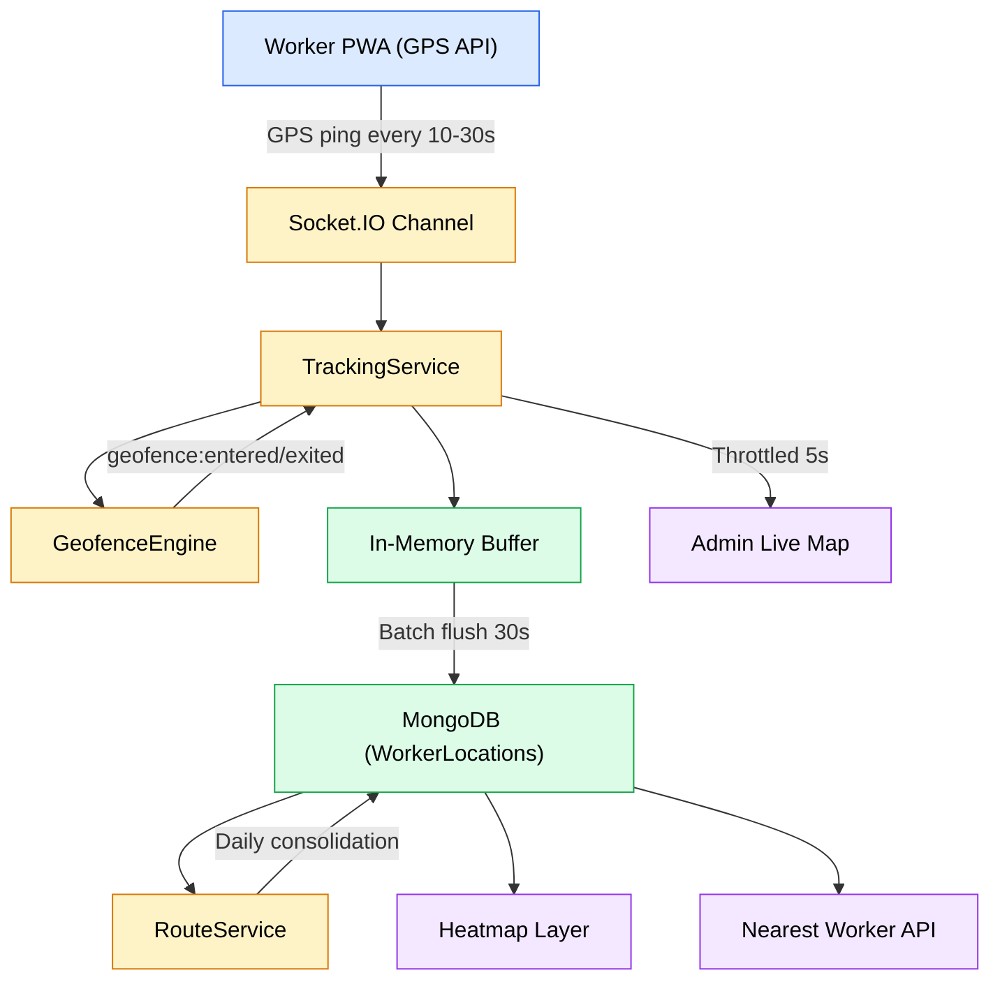
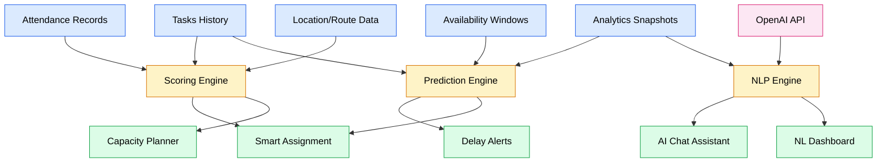
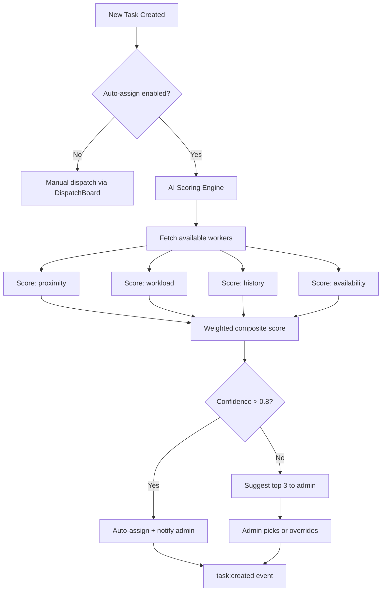
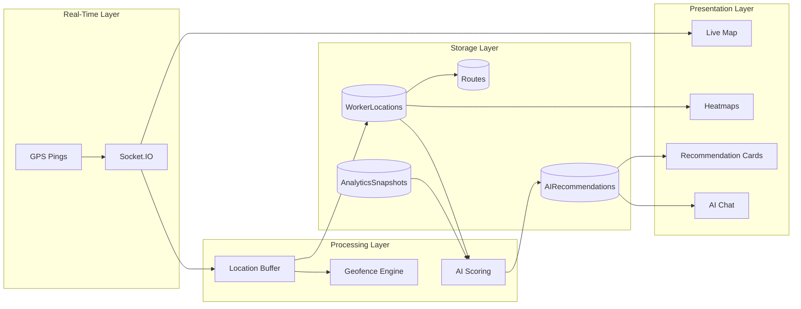

# GIS & AI Workforce Intelligence Architecture

## Smart Field Operations & Workforce Management System

> **Document 15 of 20** · Enterprise Architecture Series
>
> Cross-references: [Enterprise Blueprint](./09-Enterprise-Architecture-Blueprint.md) · [Domain Model](./10-Domain-Driven-Design.md) · [Module Dependencies](./11-Module-Dependency-Graph.md) · [Database Evolution](./12-Database-Evolution.md) · [Permissions](./13-Role-Permission-Matrix.md) · [Events](./14-Event-Driven-Architecture.md)

---

## Part A — GIS Architecture (Phase 11)

### 1. System Overview

---

### 2. GPS Tracking

| Attribute | Detail |
|-----------|--------|
| **Purpose** | Capture real-time worker position for dispatch, verification, and safety |
| **Inputs** | Browser Geolocation API (`navigator.geolocation.watchPosition`) |
| **Outputs** | `location:updated` event → `WorkerLocations` collection |
| **Dependencies** | Socket.IO (transport), MongoDB 2dsphere index |
| **API** | `Socket: worker:location-update` (inbound from device) |

**Ping frequency rules:**

| Condition | Interval | Rationale |
|-----------|----------|-----------|
| Worker has active task | 10 seconds | High precision for task verification |
| Worker checked in, no active task | 30 seconds | Presence tracking without battery drain |
| Battery < 20% | 60 seconds | Preserve device usability |
| Worker checked out | Disabled | Privacy; no tracking off-duty |

**Offline sync:** GPS pings are queued in IndexedDB when the device is offline (PWA service worker). On reconnection, the queue flushes in chronological order with original timestamps.

---

### 3. Worker Live Location

| Attribute | Detail |
|-----------|--------|
| **Purpose** | Real-time map view for Admin/Dispatcher showing all active workers |
| **Inputs** | Throttled `location:updated` events (max 1 per worker per 5s) |
| **Outputs** | Map markers with worker name, status, speed, last update time |
| **Dependencies** | Leaflet or Mapbox GL JS (frontend), Socket.IO Redis adapter (multi-instance) |
| **API** | `GET /api/tracking/active-workers` — initial load; Socket for live updates |

**Map data per worker:**

| Field | Source |
|-------|--------|
| Position (lat/lng) | Latest `WorkerLocations` document |
| Name, avatar | `Users` collection |
| Current task | `Tasks` collection (assigned + in-progress) |
| Speed / moving | GPS payload |
| Battery level | GPS payload |

---

### 4. Geofencing

| Attribute | Detail |
|-----------|--------|
| **Purpose** | Virtual boundaries that trigger actions when workers enter or exit |
| **Inputs** | Worker location + `Geofences` collection (polygons/circles) |
| **Outputs** | `geofence:entered` / `geofence:exited` events |
| **Dependencies** | `@turf/boolean-point-in-polygon` (server-side evaluation) |
| **APIs** | `POST /api/geofences`, `GET /api/geofences`, `PUT /api/geofences/:id`, `DELETE /api/geofences/:id` |

**Geofence types:**

| Type | Auto Check-In | Alert on Exit | Use Case |
|------|--------------|---------------|----------|
| `work-site` | ✅ | ✅ | Construction sites, warehouses |
| `restricted` | ❌ | ✅ (entry alert) | Hazardous zones, unauthorized areas |
| `check-in-zone` | ✅ | ❌ | Office, depot, client premises |

**Evaluation strategy:** Geofence polygons are cached in memory on server startup and refreshed on CRUD operations. Every incoming GPS ping is evaluated against cached polygons using Turf.js — no database query per ping.

---

### 5. Route Optimization

| Attribute | Detail |
|-----------|--------|
| **Purpose** | Suggest optimal task visit order to minimize travel distance |
| **Inputs** | Worker's current location + assigned task locations (GeoJSON coordinates) |
| **Outputs** | Ordered list of task IDs, estimated total distance, ETA per stop |
| **Dependencies** | Tasks collection (locationCoordinates), `@turf/distance` |
| **API** | `GET /api/tracking/routes/:workerId/optimize` |

**Algorithm:** Nearest-neighbor heuristic for MVP (O(n²), sufficient for < 50 tasks per worker). Future: integrate Google Directions API or OSRM for road-network-aware routing.

---

### 6. Heat Maps

| Attribute | Detail |
|-----------|--------|
| **Purpose** | Visualize task density and worker activity concentration across geography |
| **Inputs** | `Tasks.locationCoordinates` (task heatmap), `WorkerLocations` aggregation (activity heatmap) |
| **Outputs** | Weighted coordinate arrays rendered as Leaflet.heat overlay |
| **Dependencies** | `leaflet.heat` plugin (frontend) |
| **API** | `GET /api/tracking/heatmap?type=tasks&dateRange=last7days` |

---

### 7. Nearest Worker Search

| Attribute | Detail |
|-----------|--------|
| **Purpose** | Find available workers closest to a task location for optimal assignment |
| **Inputs** | Task coordinates + `WorkerLocations` (latest per worker) + `WorkerAvailability` |
| **Outputs** | Ranked list: `[{ workerId, name, distance, eta, currentTaskCount }]` |
| **Dependencies** | MongoDB `$near` with 2dsphere index, Availability module |
| **API** | `GET /api/tracking/nearest?lng=X&lat=Y&limit=5` |

**Query pipeline:**
1. `$geoNear` on latest WorkerLocations (one per active worker)
2. Filter by availability window (join with WorkerAvailability)
3. Filter by current workload (count active tasks)
4. Sort by distance ascending
5. Return top N

---

### 8. Fleet Support (Future)

| Attribute | Detail |
|-----------|--------|
| **Purpose** | Track company vehicles in addition to individual workers |
| **Inputs** | OBD-II / fleet GPS hardware → webhook or MQTT |
| **Outputs** | Vehicle location, fuel level, mileage, worker-vehicle assignment |
| **Dependencies** | New `Vehicles` and `VehicleLocations` collections |
| **API** | Future: `GET /api/fleet/vehicles`, `GET /api/fleet/vehicles/:id/location` |

Not in scope for Phases 9–14. Architectural placeholder only.

---

## Part B — AI Workforce Intelligence (Phase 13)

### 9. AI Architecture Overview

---

### 10. AI Features

#### 10.1 Smart Worker Assignment

| Attribute | Detail |
|-----------|--------|
| **Purpose** | Recommend the optimal worker for a new task based on multi-factor scoring |
| **Inputs** | Task (location, priority, skills required, deadline) + Worker pool (location, availability, current workload, historical completion rate, skill match) |
| **Outputs** | Ranked worker list with confidence scores and reasoning |
| **Dependencies** | Tracking (distance), Availability (schedule), Analytics (performance history) |
| **API** | `GET /api/ai/suggest-assignment?taskId=X` |

**Scoring formula (weighted):**

| Factor | Weight | Source |
|--------|--------|--------|
| Proximity to task | 30% | Latest WorkerLocation vs task coordinates |
| Current workload | 25% | Count of active tasks |
| Availability window | 20% | WorkerAvailability for task deadline |
| Historical completion rate | 15% | AnalyticsSnapshots worker metrics |
| Skill match | 10% | Future: worker skill tags vs task category |

#### 10.2 Delay Prediction

| Attribute | Detail |
|-----------|--------|
| **Purpose** | Predict tasks likely to miss their deadline before they do |
| **Inputs** | Task (deadline, status, assignedAt) + Worker (avg completion time, current location, active task count) |
| **Outputs** | `{ taskId, predictedDelay, confidence, suggestedAction }` |
| **Dependencies** | Analytics (historical avg times), Tracking (current position) |
| **API** | `GET /api/ai/delay-risks` |

**Trigger:** Cron runs every 30 minutes. Flags tasks where `estimatedCompletion > deadline` with confidence > 0.6.

#### 10.3 Productivity Score

| Attribute | Detail |
|-----------|--------|
| **Purpose** | Per-worker composite performance metric for management review |
| **Inputs** | Tasks completed, avg completion time, on-time rate, attendance regularity, distance efficiency |
| **Outputs** | Score 0–100 with breakdown per factor |
| **Dependencies** | Analytics, Attendance, Tracking |
| **API** | `GET /api/ai/productivity/:workerId` |

#### 10.4 Workload Balancing

| Attribute | Detail |
|-----------|--------|
| **Purpose** | Detect overloaded and underutilized workers, suggest redistribution |
| **Inputs** | All active task assignments, worker availability, current location spread |
| **Outputs** | List of suggested reassignments with justification |
| **Dependencies** | Tasks, Availability, Tracking |
| **API** | `GET /api/ai/workload-analysis` |

#### 10.5 Capacity Planning

| Attribute | Detail |
|-----------|--------|
| **Purpose** | Forecast workforce needs for upcoming periods |
| **Inputs** | Historical task volume (weekly/monthly trends), current workforce size, seasonal patterns |
| **Outputs** | Projected task volume vs available worker-hours, gap analysis |
| **Dependencies** | AnalyticsSnapshots (historical), Availability, Attendance |
| **API** | `GET /api/ai/capacity-forecast?period=next30days` |

#### 10.6 Task Recommendation

| Attribute | Detail |
|-----------|--------|
| **Purpose** | Suggest next-best task for an idle worker based on proximity and priority |
| **Inputs** | Worker's current location, unassigned tasks, task priorities and deadlines |
| **Outputs** | Ranked task list the worker could pick up |
| **Dependencies** | Tasks (unassigned), Tracking (worker location) |
| **API** | `GET /api/ai/recommend-tasks/:workerId` |

#### 10.7 Risk Prediction

| Attribute | Detail |
|-----------|--------|
| **Purpose** | Identify patterns that precede failures (no-shows, task abandonment, repeated rejections) |
| **Inputs** | Attendance patterns, task rejection history, late check-ins |
| **Outputs** | Risk alerts per worker with confidence and suggested intervention |
| **Dependencies** | Attendance, Analytics, Tasks |
| **API** | `GET /api/ai/risk-alerts` |

#### 10.8 Natural Language Dashboard

| Attribute | Detail |
|-----------|--------|
| **Purpose** | Admin asks questions in plain English; system returns data visualizations |
| **Inputs** | Natural language query (e.g., "Show me overdue tasks in the north zone this week") |
| **Outputs** | Structured query result + chart/table |
| **Dependencies** | OpenAI API (query parsing), Analytics, Tasks |
| **API** | `POST /api/ai/nl-query { query: "..." }` |

**Flow:** User query → OpenAI function-calling → structured MongoDB aggregation → formatted response.

#### 10.9 AI Chat Assistant

| Attribute | Detail |
|-----------|--------|
| **Purpose** | Conversational interface for admin to interact with system data |
| **Inputs** | Chat messages with conversation context |
| **Outputs** | AI responses with embedded data, charts, and actionable suggestions |
| **Dependencies** | OpenAI API (GPT-4o-mini for cost efficiency), all data modules |
| **API** | `POST /api/ai/chat { message, conversationId }` |

**Context window:** System prompt includes current KPI summary, active alerts, and recent events. User messages are appended. Conversation history stored in-memory (session-scoped, not persisted).

#### 10.10 Future LLM Integration

| Attribute | Detail |
|-----------|--------|
| **Purpose** | Abstraction layer for swapping LLM providers |
| **Design** | `ai/providers/` directory with interface: `generateCompletion(prompt, options)` → implementations for OpenAI, Google Gemini, local Ollama |
| **Dependencies** | None at architecture level — provider-agnostic interface |

---

### 11. AI Decision Flow

---

### 12. GIS + AI Data Flow (Combined)

---

### 13. Future APIs Summary

| Phase | Endpoint | Method | Purpose |
|-------|----------|--------|---------|
| 11 | `/api/tracking/active-workers` | GET | All active worker positions |
| 11 | `/api/tracking/nearest` | GET | Workers nearest to coordinates |
| 11 | `/api/tracking/routes/:workerId/optimize` | GET | Optimized task visit order |
| 11 | `/api/tracking/heatmap` | GET | Coordinate density data |
| 11 | `/api/geofences` | CRUD | Geofence management |
| 13 | `/api/ai/suggest-assignment` | GET | Smart worker recommendation |
| 13 | `/api/ai/delay-risks` | GET | At-risk task predictions |
| 13 | `/api/ai/productivity/:workerId` | GET | Worker performance score |
| 13 | `/api/ai/workload-analysis` | GET | Workload distribution insights |
| 13 | `/api/ai/capacity-forecast` | GET | Workforce demand projection |
| 13 | `/api/ai/recommend-tasks/:workerId` | GET | Next-best task for worker |
| 13 | `/api/ai/risk-alerts` | GET | Worker risk predictions |
| 13 | `/api/ai/nl-query` | POST | Natural language data query |
| 13 | `/api/ai/chat` | POST | Conversational AI assistant |

---

*Last updated: July 2026*
