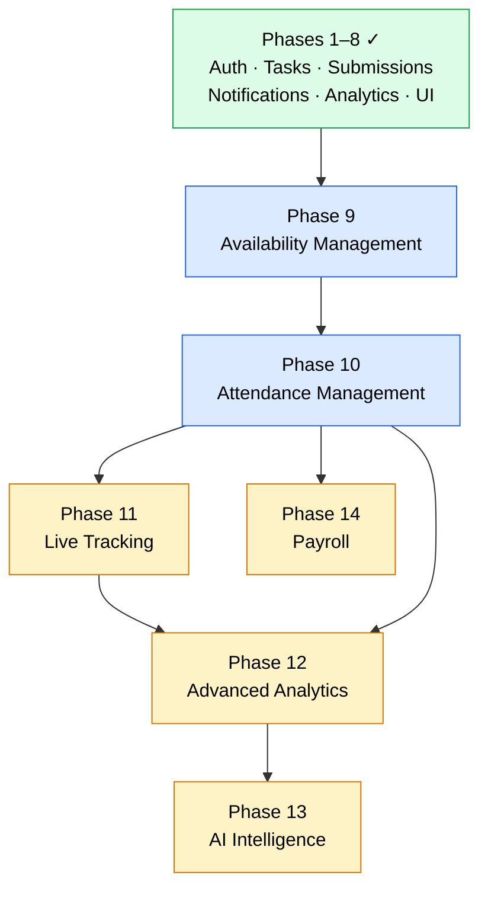

# Implementation Phases v2 — Master Roadmap

## Smart Field Operations & Workforce Management System

> **Document 16 of 20** · Enterprise Architecture Series
>
> Cross-references: [Blueprint](./09-Enterprise-Architecture-Blueprint.md) · [DDD](./10-Domain-Driven-Design.md) · [Dependencies](./11-Module-Dependency-Graph.md) · [Database](./12-Database-Evolution.md) · [RBAC](./13-Role-Permission-Matrix.md) · [Events](./14-Event-Driven-Architecture.md) · [GIS & AI](./15-GIS-AI-Architecture.md)

**Phases 1–8 are complete.** This document covers Phases 9–14 only. Each phase is self-contained and buildable without future-phase knowledge.

---

## Phase 9 — Availability Management

### Objectives

Enable workers to declare when they are available for task assignment. Enable admins to view workforce availability at a glance and approve leave requests. Eliminate blind assignment of tasks to unavailable workers.

### Database

| Collection | Key Fields | Indexes | Ref: [Database Evolution §3.1](./12-Database-Evolution.md) |
|------------|-----------|---------|------|
| **WorkerAvailability** | `workerId`, `dayOfWeek` (0–6), `startTime`, `endTime`, `isRecurring`, `effectiveFrom`, `effectiveUntil` | `{ workerId: 1, dayOfWeek: 1 }` unique |
| **LeaveRequests** | `workerId`, `type` (sick/personal/vacation/emergency), `startDate`, `endDate`, `reason`, `status` (pending/approved/rejected), `approvedBy` | `{ workerId: 1, startDate: 1 }`, `{ status: 1 }` |

No changes to existing collections.

### Backend

| Layer | Files | Details |
|-------|-------|---------|
| **Model** | `availability.model.js`, `leave-request.model.js` | Mongoose schemas per [Database Evolution](./12-Database-Evolution.md) |
| **Validation** | `availability.validation.js` | Zod schemas for create/update availability, create/approve leave |
| **Service** | `availability.service.js` | CRUD availability windows, leave request workflow, overlap detection |
| **Controller** | `availability.controller.js` | Thin HTTP handlers |
| **Routes** | `availability.routes.js` | See API table below |

### APIs

| Method | Endpoint | Auth | Purpose |
|--------|----------|------|---------|
| GET | `/api/availability/:workerId` | admin, dispatcher | View worker's schedule |
| GET | `/api/availability/me` | worker | View own schedule |
| PUT | `/api/availability/me` | worker | Set own weekly windows |
| PUT | `/api/availability/:workerId` | admin | Admin override schedule |
| POST | `/api/leave-requests` | worker | Submit leave request |
| GET | `/api/leave-requests` | admin | List all pending requests |
| GET | `/api/leave-requests/me` | worker | Own leave history |
| PATCH | `/api/leave-requests/:id/approve` | admin | Approve or reject |

### Socket Events

| Event | Publisher | Subscribers | Ref: [Events §3](./14-Event-Driven-Architecture.md) |
|-------|----------|-------------|------|
| `availability:updated` | availability.service | DispatchBoard | |
| `leave:requested` | availability.service | Admin room, NotificationsService | |
| `leave:approved` | availability.service | Worker room, NotificationsService, Email | |

### Frontend

| Component | Location | Purpose |
|-----------|----------|---------|
| `AvailabilityGrid.jsx` | `features/availability/` | Weekly time-slot selector (Mon–Sun grid) |
| `LeaveRequestForm.jsx` | `features/availability/` | Submit leave with type, dates, reason |
| `LeaveRequestList.jsx` | `features/availability/` | Admin approval queue |
| `MyAvailability.jsx` | `pages/worker/` | Worker self-manage page |
| `AvailabilityManagement.jsx` | `pages/admin/` | Admin overview + leave approvals |

### Testing Checklist

- [ ] Worker sets weekly availability; persists across sessions
- [ ] Overlapping time windows rejected
- [ ] Leave request creates notification for admin
- [ ] Approved leave updates worker availability for date range
- [ ] Dispatcher sees availability on dispatch board before assigning
- [ ] Workers without availability records treated as "always available"

### Acceptance Criteria

- Worker can set and edit recurring weekly schedule
- Leave requests follow pending → approved/rejected workflow
- Admin dashboard shows availability grid for all workers
- Task assignment UI warns when assigning to unavailable worker

**Complexity:** Medium · **Estimated effort:** 1–2 weeks

---

## Phase 10 — Attendance Management

### Objectives

Track worker check-in/check-out with GPS-verified timestamps. Support shift management, late detection, and overtime calculation. Provide attendance history for workers and managers.

### Database

| Collection | Key Fields | Indexes |
|------------|-----------|---------|
| **AttendanceRecords** | `workerId`, `date`, `checkIn` (embedded: time, location, method), `checkOut` (embedded), `totalHours`, `status` (present/absent/late/half-day/on-leave), `overtime` | `{ workerId: 1, date: 1 }` unique, `{ date: 1, status: 1 }` |
| **Shifts** | `name`, `startTime`, `endTime`, `gracePeriodMinutes`, `workers[]`, `isActive` | `{ isActive: 1 }` |

Schema change to Users: add optional `shiftId` field.

### Backend

| Layer | Files |
|-------|-------|
| **Models** | `attendance.model.js`, `shifts.model.js` |
| **Validation** | `attendance.validation.js` |
| **Service** | `attendance.service.js` — check-in/out logic, late detection, hours calculation, shift enforcement |
| **Controller** | `attendance.controller.js` |
| **Routes** | `attendance.routes.js` |

### APIs

| Method | Endpoint | Auth | Purpose |
|--------|----------|------|---------|
| POST | `/api/attendance/check-in` | worker | GPS-verified check-in |
| POST | `/api/attendance/check-out` | worker | GPS-verified check-out |
| GET | `/api/attendance/me` | worker | Own attendance history |
| GET | `/api/attendance` | admin | All attendance records (filterable) |
| PUT | `/api/attendance/:id` | admin | Manual correction |
| POST | `/api/shifts` | admin | Create shift |
| GET | `/api/shifts` | admin | List shifts |
| PUT | `/api/shifts/:id` | admin | Update shift |
| DELETE | `/api/shifts/:id` | admin | Remove shift |

### Socket Events

| Event | Publisher | Subscribers |
|-------|----------|-------------|
| `attendance:checked-in` | attendance.service | Admin room, LiveMap, Analytics |
| `attendance:checked-out` | attendance.service | Admin room, Analytics, PayrollService |
| `attendance:late` | attendance.service | Manager room, NotificationsService, Email |

### Frontend

| Component | Location | Purpose |
|-----------|----------|---------|
| `CheckInButton.jsx` | `features/attendance/` | One-tap check-in with GPS capture |
| `AttendanceLog.jsx` | `features/attendance/` | Tabular attendance history |
| `ShiftManager.jsx` | `features/attendance/` | Admin CRUD for shifts |
| `CheckIn.jsx` | `pages/worker/` | Worker check-in/out page |
| `AttendanceDashboard.jsx` | `pages/admin/` | Admin attendance overview |

### Testing Checklist

- [ ] Check-in records GPS coordinates and timestamp
- [ ] Duplicate check-in on same day rejected
- [ ] Check-out calculates `totalHours` and `overtime` automatically
- [ ] Late status triggered when check-in exceeds shift start + grace period
- [ ] Manual correction by admin creates `attendance:corrected` event
- [ ] Attendance respects leave requests from Phase 9

### Acceptance Criteria

- Workers check in/out from PWA with GPS verification
- System auto-detects late arrivals based on shift schedule
- Admin can view, filter, and correct attendance records
- Overtime calculated when hours exceed shift duration

**Complexity:** Medium-High · **Estimated effort:** 2–3 weeks · **Depends on:** Phase 9 (availability/leave data)

---

## Phase 11 — Live Tracking

### Objectives

Real-time GPS tracking of field workers. Admin/Dispatcher live map. Geofence-triggered actions. Route optimization. Ref: [GIS Architecture](./15-GIS-AI-Architecture.md)

### Database

| Collection | Key Fields | Indexes | Notes |
|------------|-----------|---------|-------|
| **WorkerLocations** | `workerId`, `location` (GeoJSON), `accuracy`, `speed`, `heading`, `batteryLevel`, `isMoving`, `timestamp` | `{ workerId: 1, timestamp: -1 }`, `{ location: "2dsphere" }`, `{ timestamp: 1 }` TTL 7d | High-write; buffer in memory |
| **Geofences** | `name`, `type`, `boundary` (GeoJSON Polygon), `center`, `radius`, `rules`, `linkedTasks[]`, `isActive`, `createdBy` | `{ boundary: "2dsphere" }`, `{ center: "2dsphere" }` | |
| **Routes** | `workerId`, `date`, `waypoints[]`, `totalDistance`, `optimizedOrder[]` | `{ workerId: 1, date: -1 }` unique | Daily consolidation |

### Backend

| Layer | Files |
|-------|-------|
| **Models** | `location.model.js`, `geofence.model.js`, `route.model.js` |
| **Services** | `tracking.service.js`, `geofence.service.js`, `route.service.js` |
| **Controller** | `tracking.controller.js` |
| **Routes** | `tracking.routes.js` |

### APIs

| Method | Endpoint | Auth | Purpose |
|--------|----------|------|---------|
| GET | `/api/tracking/active-workers` | admin, dispatcher | All active worker positions |
| GET | `/api/tracking/nearest` | admin, dispatcher | Workers nearest to coordinates |
| GET | `/api/tracking/routes/:workerId/optimize` | admin, dispatcher | Optimized task order |
| GET | `/api/tracking/heatmap` | admin | Coordinate density data |
| CRUD | `/api/geofences` | admin | Geofence management |

### Socket Events

| Event | Direction | Purpose |
|-------|-----------|---------|
| `worker:location-update` | Client → Server | Worker sends GPS ping |
| `location:updated` | Server → Admin room | Throttled broadcast (5s) |
| `geofence:entered` | Server → relevant rooms | Worker enters zone |
| `geofence:exited` | Server → relevant rooms | Worker exits zone |

### Performance Considerations

- GPS pings buffered in memory, flushed to MongoDB every 30 seconds
- Geofence polygons cached in-memory, refreshed on CRUD
- Socket broadcasts throttled to max 1 per worker per 5 seconds
- Reduced ping frequency on low battery (client-side)
- New packages: `@turf/turf` (backend), `leaflet` + `react-leaflet` (frontend)

### Frontend

| Component | Purpose |
|-----------|---------|
| `LiveMap.jsx` | Real-time worker map with markers |
| `GeofenceEditor.jsx` | Draw/edit geofence polygons on map |
| `WorkerTrail.jsx` | Historical route replay |
| `NearestWorkerPanel.jsx` | Ranked list for assignment |
| `LiveTrackingDashboard.jsx` | Admin page composing map + panels |
| `GeofenceManager.jsx` | Admin geofence CRUD page |

### Acceptance Criteria

- Live map shows all checked-in workers with < 10s latency
- Geofence entry/exit triggers notifications
- Nearest-worker query returns results sorted by distance
- Route optimization suggests visit order for assigned tasks
- TTL auto-purges raw GPS data after 7 days; Routes preserve daily summaries

**Complexity:** High · **Estimated effort:** 3–4 weeks · **Depends on:** Phase 10 (check-in status for tracking activation)

---

## Phase 12 — Advanced Analytics

### Objectives

Pre-computed analytics snapshots. Historical trend charts. Exportable reports. Extend existing analytics module without replacing live aggregation pipelines.

### Database

| Collection | Key Fields | Indexes |
|------------|-----------|---------|
| **AnalyticsSnapshots** | `type` (daily/weekly/monthly), `date`, `metrics` (embedded KPIs), `workerMetrics[]` (embedded per-worker stats) | `{ type: 1, date: -1 }` unique |

### Backend

| Layer | Files |
|-------|-------|
| **Model** | `analytics-snapshot.model.js` |
| **Cron** | `analytics-cron.js` — scheduled via `node-cron` (daily at midnight, weekly on Sunday, monthly on 1st) |
| **Service** | Extend existing `analytics.service.js` with snapshot queries and comparison logic |

### APIs (extend existing `/api/analytics`)

| Method | Endpoint | Auth | Purpose |
|--------|----------|------|---------|
| GET | `/api/analytics/trends` | admin | Historical trend data (snapshots) |
| GET | `/api/analytics/attendance-summary` | admin | Attendance analytics |
| GET | `/api/analytics/workload-distribution` | admin | Per-worker task distribution |
| GET | `/api/analytics/export` | admin | CSV/PDF report generation |

### Frontend

| Component | Purpose |
|-----------|---------|
| `TrendCharts.jsx` | Line/bar charts for task completion over time |
| `AttendanceCharts.jsx` | Attendance rate visualization |
| `WorkloadChart.jsx` | Per-worker task distribution |
| `ExportButton.jsx` | Download CSV/PDF |
| `AdvancedAnalytics.jsx` | Admin page composing all chart widgets |

New packages: `chart.js` + `react-chartjs-2` (frontend), `node-cron` (backend)

### Acceptance Criteria

- Daily/weekly/monthly snapshots generated automatically via cron
- Dashboard loads from snapshots (< 200ms) instead of live aggregation
- Trend charts show selectable date ranges
- Export produces downloadable CSV with all metrics
- Existing `/api/analytics/summary` continues to work unchanged

**Complexity:** Medium · **Estimated effort:** 2 weeks · **Depends on:** Phase 10 (attendance data), Phase 11 (tracking data)

---

## Phase 13 — AI Workforce Intelligence

### Objectives

AI-powered assignment, prediction, and conversational analytics. Ref: [GIS & AI Architecture §Part B](./15-GIS-AI-Architecture.md)

### Database

| Collection | Key Fields | Indexes |
|------------|-----------|---------|
| **AIRecommendations** | `type`, `targetUserId`, `targetTaskId`, `recommendation`, `confidence`, `reasoning`, `status`, `feedback`, `modelVersion` | `{ type: 1, status: 1 }`, `{ createdAt: 1 }` TTL 90d |

Schema change to Tasks: add optional `aiScore` field.

### Backend

| Layer | Files |
|-------|-------|
| **Model** | `recommendation.model.js` |
| **Services** | `ai.service.js` (orchestrator), `scoring.service.js` (worker ranking), `prediction.service.js` (delay/risk), `nlp.service.js` (OpenAI wrapper) |
| **Controller** | `ai.controller.js` |
| **Routes** | `ai.routes.js` |
| **Provider** | `ai/providers/openai.js` — abstraction for LLM calls |

### APIs

| Method | Endpoint | Auth | Purpose |
|--------|----------|------|---------|
| GET | `/api/ai/suggest-assignment?taskId=X` | admin, dispatcher | Top worker recommendations |
| GET | `/api/ai/delay-risks` | admin | Tasks at risk of missing deadline |
| GET | `/api/ai/productivity/:workerId` | admin | Composite performance score |
| GET | `/api/ai/workload-analysis` | admin | Overloaded/underutilized detection |
| GET | `/api/ai/capacity-forecast` | admin | Workforce demand projection |
| GET | `/api/ai/recommend-tasks/:workerId` | admin, dispatcher | Next-best task for idle worker |
| GET | `/api/ai/risk-alerts` | admin | Worker risk predictions |
| POST | `/api/ai/nl-query` | admin | Natural language → data query |
| POST | `/api/ai/chat` | admin | Conversational AI assistant |

### Frontend

| Component | Purpose |
|-----------|---------|
| `AIRecommendationCard.jsx` | Accept/reject suggestion card |
| `SmartAssignmentPanel.jsx` | AI-ranked worker list in dispatch |
| `DelayAlertBanner.jsx` | At-risk task warnings |
| `ProductivityGauge.jsx` | Worker score visualization |
| `AIChatPanel.jsx` | Chat interface sidebar |
| `AIInsights.jsx` | Admin page composing AI widgets |
| `SmartDispatch.jsx` | AI-enhanced dispatch board |

New packages: `openai` (backend)

### Acceptance Criteria

- Smart assignment returns ranked workers with confidence > 0.6
- Delay prediction flags at-risk tasks at least 2 hours before deadline
- Chat assistant answers data questions using system context
- All AI features degrade gracefully if OpenAI API is unavailable (fallback to manual)
- Recommendations stored with `status` tracking (pending/accepted/rejected)

**Complexity:** High · **Estimated effort:** 4–5 weeks · **Depends on:** Phase 12 (historical analytics data for training)

---

## Phase 14 — Payroll (Optional Enterprise Module)

### Objectives

Calculate worker pay based on attendance hours, task completions, and configurable rates. Admin approval workflow. Worker payslip access.

### Database

| Collection | Key Fields | Indexes |
|------------|-----------|---------|
| **PayrollEntries** | `workerId`, `period` (startDate, endDate), `regularHours`, `overtimeHours`, `tasksCompleted`, `baseRate`, `overtimeRate`, `bonuses[]`, `deductions[]`, `grossPay`, `netPay`, `status` (draft/calculated/approved/paid), `approvedBy` | `{ workerId: 1, "period.startDate": 1 }` unique, `{ status: 1 }` |

Schema change to Users: add optional `hourlyRate`, `overtimeRate` fields.

### Backend

| Layer | Files |
|-------|-------|
| **Model** | `payroll.model.js` |
| **Service** | `payroll.service.js` — batch calculation from AttendanceRecords + Tasks |
| **Controller** | `payroll.controller.js` |
| **Routes** | `payroll.routes.js` |

### APIs

| Method | Endpoint | Auth | Purpose |
|--------|----------|------|---------|
| POST | `/api/payroll/calculate` | admin | Run payroll for period |
| GET | `/api/payroll` | admin | List all payroll entries |
| GET | `/api/payroll/me` | worker | Own payslips |
| PATCH | `/api/payroll/:id/approve` | admin | Approve payroll entry |

### Frontend

| Component | Purpose |
|-----------|---------|
| `PayrollCalculator.jsx` | Period selector + batch run |
| `PayrollTable.jsx` | Sortable payroll list with approval buttons |
| `PayslipDetail.jsx` | Breakdown view for worker |
| `PayrollDashboard.jsx` | Admin page |
| `MyPayslips.jsx` | Worker page |

### Acceptance Criteria

- Payroll calculation pulls hours from AttendanceRecords automatically
- Overtime calculated based on shift duration thresholds
- Task-based bonuses configurable per task priority
- Approval workflow: draft → calculated → approved → paid
- Workers see only their own payslips

**Complexity:** Medium · **Estimated effort:** 2 weeks · **Depends on:** Phase 10 (attendance hours data)

---

## Overall Dependency Timeline

### Why Each Phase Depends on the Previous

| Transition | Reason |
|------------|--------|
| **P1–8 → P9** | Availability extends the User entity. Requires stable auth, user management, and notification infrastructure. |
| **P9 → P10** | Attendance validation checks availability windows to detect absences vs. scheduled off-days. Leave requests feed into attendance status. |
| **P10 → P11** | Live tracking activates only for checked-in workers. Geofence auto check-in writes to AttendanceRecords. |
| **P10 + P11 → P12** | Advanced analytics aggregates across tasks (P1–8), attendance (P10), and tracking (P11). Cannot produce meaningful snapshots without attendance and location data. |
| **P12 → P13** | AI scoring and predictions require historical analytics snapshots for pattern recognition. Without Phase 12 data, AI recommendations have no training signal. |
| **P10 → P14** | Payroll calculates pay from AttendanceRecords (hours worked, overtime). Cannot function without attendance data. Independent of Phases 11–13. |

### Total Estimated Timeline

| Phase | Effort | Running Total |
|-------|--------|---------------|
| Phase 9 | 1–2 weeks | 2 weeks |
| Phase 10 | 2–3 weeks | 5 weeks |
| Phase 11 | 3–4 weeks | 9 weeks |
| Phase 12 | 2 weeks | 11 weeks |
| Phase 13 | 4–5 weeks | 16 weeks |
| Phase 14 | 2 weeks | 18 weeks |

---

*Last updated: July 2026 · This is the master roadmap. Implementation proceeds phase-by-phase without architectural redesign.*
